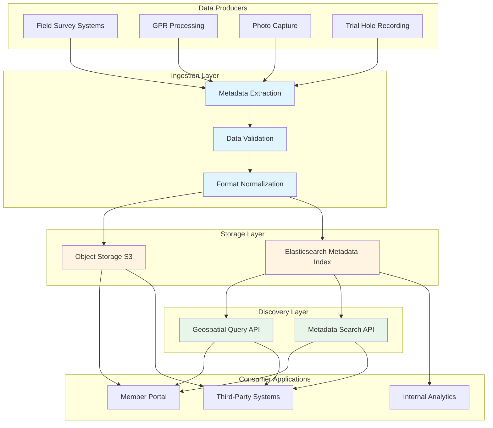
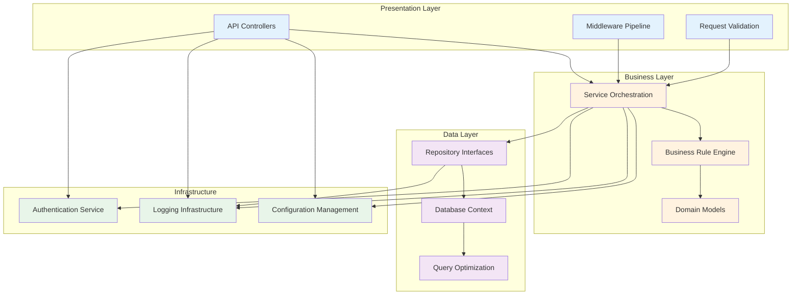
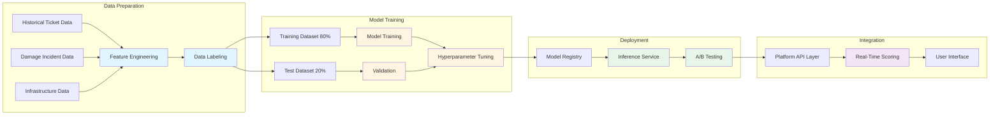

# PELICANCORP TECHNICAL ARCHITECTURE WHITEPAPER

**Platform Modernization, Intelligence Integration, and Data Marketplace Architecture**

20th November 2025

[Reserved for PelicanCorp branding]

---

## EXECUTIVE SUMMARY

This document presents the technical architecture and engineering direction underlying PelicanCorp's platform modernization initiatives. The material addresses three interconnected architectural pillars: data marketplace infrastructure, platform modernization through AI-assisted engineering, and real-time intelligence systems powered by machine learning.

The initiatives described represent a coordinated engineering effort to transition from monolithic, framework-dependent systems to modular, cloud-native architectures. These changes are not superficial technology updates but fundamental reconstructions of how data flows through the platform, how services communicate, and how intelligence is embedded into operational workflows.

Key architectural advances include:

- A serverless data marketplace infrastructure that decouples metadata discovery from data storage, enabling scalable commercial data exchange across multiple markets.

- Demonstrated engineering productivity gains through AI-assisted development patterns, with clean architecture principles applied systematically to legacy system modernization.

- Machine learning pipelines designed for real-time risk inference, with product-agnostic integration patterns that preserve modularity while delivering predictive insights at the point of decision.

- API-first design patterns that expose platform capabilities as composable services, supporting both internal product evolution and external integration requirements.

These technical directions are designed to address scalability constraints, reduce technical debt, and establish patterns that support long-term platform evolution across geographically distributed operations.

---

## TECHNICAL VISION OVERVIEW

The projects documented here share a common engineering philosophy: intelligent systems require modern architecture, not just modern algorithms. Data marketplace capabilities depend on metadata discoverability. Machine learning models require clean data pipelines. AI-assisted engineering demands disciplined review workflows. Each initiative addresses specific technical challenges while contributing to a coherent platform direction.

### Guiding Engineering Principles

Several principles guide the architectural decisions across these initiatives:

- **Separation of concerns** through layered architecture patterns ensures that business logic remains independent of infrastructure implementation. This modularity enables component replacement without system-wide rewrites.

- **Metadata-driven design** allows systems to reason about data structure and meaning without hard-coded dependencies. This pattern appears in both the data marketplace and machine learning feature engineering.

- **API-first development** treats every significant capability as a service that can be composed, tested, and evolved independently. This approach supports both product development and ecosystem integration.

- **Observability as a first-class concern** means that logging, health checks, and performance metrics are embedded during initial development, not retrofitted later.

- **Automated validation** through continuous testing provides confidence in system behavior as code evolves, particularly important when leveraging AI-assisted code generation.

### Strategic Role of Intelligence and Automation

Intelligence integration takes multiple forms across the platform:

- Predictive models that surface risk patterns before incidents occur, embedded directly into user workflows rather than isolated reporting tools.

- Automated code generation that accelerates engineering productivity while maintaining quality through structured review processes.

- Smart data discovery mechanisms that allow users to find relevant information without understanding underlying storage topology.

- Pattern recognition in operational data that identifies anomalies, recurring issues, and optimization opportunities across system logs and user behavior.

These capabilities are implemented as discrete services with well-defined interfaces, allowing incremental adoption and independent evolution of intelligence components.

---

## COMMON ARCHITECTURE THEMES

### Engineering Patterns Shared Across Initiatives

Despite addressing different technical domains, the projects share recurring architectural patterns:

- **Containerization** provides deployment portability across cloud and on-premises environments. Docker-based packaging with multi-stage builds ensures consistent runtime behavior regardless of infrastructure.

- **Asynchronous processing** decouples request handling from long-running operations, improving responsiveness and enabling horizontal scaling. This pattern appears in both data processing pipelines and API request handling.

- **Event-driven communication** allows services to react to state changes without tight coupling. This architecture supports future extensions where new services can subscribe to existing event streams.

- **Structured logging** with correlation identifiers enables request tracing across service boundaries, essential for debugging distributed systems and understanding performance bottlenecks.

- **Health check endpoints** provide operational visibility into service status, enabling automated monitoring and orchestration in production environments.

### Use of Standardized APIs

The platform adopts RESTful API design with consistent patterns:

- Resource-oriented endpoints that map to domain concepts rather than implementation details.

- Standard HTTP status codes for error signaling, with structured error responses that provide actionable context.

- JWT-based authentication integrated with the authentication service, enabling stateless verification across distributed components.

- Rate limiting and throttling to prevent resource exhaustion and ensure fair usage across clients.

- API versioning strategies that allow evolution without breaking existing integrations.

### Modernization Methods

Legacy system modernization follows a structured approach:

- Behavioral compatibility testing ensures that new implementations preserve existing functionality exactly, preventing regression during migration.

- Incremental migration patterns allow partial rollout and validation before full cutover, reducing risk in production transitions.

- Clean architecture refactoring separates business logic from framework dependencies, improving testability and reducing coupling to specific technology stacks.

- Automated security scanning and compliance checks embedded in build pipelines catch vulnerabilities early in development cycles.

### Metadata-Driven Design

Metadata serves as the foundation for several key capabilities:

- Schema discovery allows clients to understand data structure without prior knowledge, supporting dynamic form generation and validation.

- Feature catalogs enable machine learning systems to select relevant signals without hard-coded dependencies on specific data sources.

- Configuration as metadata permits runtime behavior changes without code deployment, supporting regional customization and experimentation.

- Data lineage tracking through metadata enables understanding of how information flows through the platform, essential for compliance and debugging.

### Automated Pipelines

Automation appears throughout the architecture:

- Continuous integration pipelines that build, test, and package code on every commit, with automated quality gates that prevent defective code from reaching production.

- Model training pipelines that ingest updated data, retrain predictive models, and deploy new versions with automated rollback on performance degradation.

- Data synchronization workflows that move information between systems reliably, with retry logic and dead letter queues for failed operations.

- Infrastructure provisioning through code enables consistent environment creation and reduces manual configuration errors.

---

## PILLAR 1: DATA MARKETPLACE AND ENRICHMENT

### Architecture Overview

The data marketplace implements a serverless architecture designed for scalability and cost efficiency. The system operates on a principle of metadata separation: searchable metadata lives in Elasticsearch for fast querying, while actual data files reside in object storage. This decoupling allows independent scaling of discovery and delivery capabilities.

The architecture supports multiple data formats including field survey outputs, GPR data, photographs, trial hole records, and various geospatial datasets. Data owners retain control over their content while making it discoverable to authorized consumers through a standardized metadata catalog.

### Metadata Layer Design

The metadata layer provides a searchable abstraction over heterogeneous data sources. Each data product entry contains:

- Geospatial extent defined as bounding boxes or polygon geometries, enabling location-based discovery.

- Temporal metadata indicating collection dates and validity periods, supporting time-series queries.

- Data quality indicators including resolution, accuracy estimates, and collection methodology.

- Provenance information tracking data origin, processing history, and ownership.

- Access control metadata defining permission requirements and licensing terms.

- Schema descriptors that allow consumers to understand data structure before retrieval.

This metadata richness enables sophisticated discovery queries such as "find all GPR surveys within 500 meters of this location, collected in the last two years, with resolution better than 10cm."

### Geospatial and Operational Data Flow

Data ingestion follows a multi-stage pipeline:

1. **Initial validation** checks format compliance and completeness before accepting data into the system.

2. **Metadata extraction** automatically derives geospatial extent, temporal range, and schema information from source files.

3. **Quality scoring** applies heuristics to estimate data reliability based on collection parameters and processing methods.

4. **Index population** updates the Elasticsearch catalog with searchable metadata, including spatial and temporal indices.

5. **Storage commitment** moves validated data files to object storage with appropriate lifecycle policies.

6. **Notification dispatch** informs subscribed systems of new data availability matching their interest criteria.

This pipeline architecture allows independent scaling of ingestion throughput and query capacity, with buffering mechanisms to handle bursts in data production.

### Storage Patterns

Object storage provides cost-effective, durable storage for data files:

- Hierarchical organization by geographic region and data type supports efficient retrieval patterns.

- Lifecycle policies automatically transition older data to archive tiers, reducing storage costs while maintaining availability.

- Versioning support allows tracking data updates without losing historical versions.

- Pre-signed URL generation enables time-limited, secure access without direct authentication to storage systems.

- Cross-region replication for critical datasets ensures availability even in regional infrastructure failures.

The separation of hot metadata in Elasticsearch and cold data in object storage provides optimal cost-performance balance, with query performance determined by metadata operations rather than data transfer.

### Interactive Mapping Portal

The mapping portal demonstrates a transition from static document delivery to interactive geospatial visualization. The system integrates multiple data sources:

- Locally hosted GIS datasets served through tile rendering engines optimized for web delivery.

- Remote map services consumed through standard OGC protocols (WMS, WFS, WMTS) without requiring data duplication.

- Third-party geospatial APIs providing real-time information such as weather overlays or infrastructure updates.

Dynamic layer composition allows users to combine relevant datasets for their specific use case, with client-side rendering reducing server load and improving responsiveness.

The portal implements progressive enhancement: basic map functionality works without JavaScript, while interactive features layer on top for capable clients. This ensures accessibility across device types and network conditions.

Users can export composed map views as standard GIS formats for use in external design and analysis tools, maintaining workflow integration while providing superior discovery and preview capabilities compared to static file distribution.

---

## PILLAR 2: PLATFORM MODERNIZATION AND ENGINEERING PRODUCTIVITY

### Clean Architecture Implementation

Platform modernization centers on systematic application of clean architecture principles. This approach separates concerns into distinct layers with explicit dependency rules:

- The **presentation layer** handles HTTP routing, request parsing, and response formatting without containing business logic.

- The **business layer** encapsulates domain rules and workflows, implementing policies independent of infrastructure concerns.

- The **data layer** manages persistence operations, translating between domain models and storage representations.

- The **shared layer** provides cross-cutting concerns such as logging, configuration, and common data types.

Dependency flow is strictly inward: outer layers depend on inner layers, but core business logic has no knowledge of presentation or data access specifics. This inversion of control enables testing business logic without database or HTTP infrastructure.

The platform inject API modernization demonstrates this pattern: controllers handle HTTP concerns, services implement business validation and orchestration, repositories abstract database operations, and domain models represent core concepts without framework dependencies.

### Containerization Strategy

Docker-based containerization provides deployment portability with several architectural benefits:

- Multi-stage builds separate build-time dependencies from runtime requirements, producing minimal container images that reduce attack surface and deployment size.

- Base image standardization across services ensures consistent runtime environment and simplifies security patching.

- Container orchestration readiness allows deployment to Kubernetes, ECS, or similar platforms without application changes.

- Resource constraint specification enables predictable performance in shared infrastructure and prevents resource exhaustion.

- Health check integration allows orchestrators to detect and replace unhealthy instances automatically.

Container images are stored in registries with vulnerability scanning, ensuring that only verified images reach production environments. The same container that passes testing in development runs in production, eliminating environment-specific configuration issues.

### Automated Testing Framework

Comprehensive automated testing provides confidence in system behavior:

- **Unit tests** verify individual components in isolation, with dependency injection allowing mock substitution for external services.

- **Integration tests** validate interaction between components, using test containers to provide real database and messaging infrastructure.

- **Contract tests** ensure API compatibility, detecting breaking changes before they reach production.

- **Performance tests** measure throughput and latency under load, establishing baselines and detecting performance regression.

- **Security tests** scan for common vulnerabilities and verify authentication and authorization behavior.

Test execution is automated in continuous integration pipelines, with coverage reporting and quality gates that prevent merging of untested code. This automation is particularly valuable when AI-assisted code generation increases code velocity, as it provides rapid feedback on generated code quality.

### AI-Assisted Engineering as Acceleration

AI-assisted development serves as a productivity multiplier without replacing engineering judgment. The approach uses AI for pattern generation and developers for validation and refinement:

- **Code generation** handles repetitive structure: repository patterns, controller scaffolding, basic CRUD operations, and test templates. This eliminates boilerplate while maintaining consistency.

- **Architectural guidance** from AI suggests appropriate design patterns and identifies potential issues, serving as a second pair of eyes during development.

- **Test generation** creates initial test cases based on code structure, which developers then refine to cover edge cases and business-specific scenarios.

- **Documentation generation** produces initial API documentation from code structure, which developers enhance with usage examples and business context.

The human role shifts from typing code to architectural decision-making, business logic validation, security review, and quality assurance. This division of labor accelerates delivery while maintaining or improving quality through increased focus on high-value activities.

The engineering workflow integrates AI-generated output with structured review:

1. **Generation phase** produces initial implementation based on requirements and architectural templates.

2. **Review phase** validates correctness, security, and alignment with business rules.

3. **Refinement phase** adjusts implementation details, optimizes performance, and enhances error handling.

4. **Testing phase** verifies behavior through automated test execution and manual validation.

5. **Documentation phase** captures design decisions and usage patterns for future reference.

This structured approach ensures that speed gains from AI assistance do not compromise quality or introduce technical debt.

### System Modularity

Modular architecture enables independent evolution of components:

- Service boundaries align with domain concepts, minimizing coupling and clarifying ownership.

- Interface definitions provide contracts between components, allowing implementation changes without affecting clients.

- Dependency injection configures component relationships at runtime, supporting testing with mock implementations and deployment with different backing services.

- Feature flags control functionality rollout, enabling progressive delivery and rapid rollback if issues arise.

- Configuration externalization allows behavior adjustment without code changes, supporting regional customization.

This modularity is essential for large-scale platform evolution: different teams can work on different services concurrently without coordination overhead, and services can be replaced or upgraded independently as requirements evolve.

---

## PILLAR 3: REAL-TIME INTELLIGENCE AND ML-DRIVEN RISK ANALYSIS

### Machine Learning Model Pipeline

The risk intelligence system implements a complete machine learning pipeline from data preparation through inference:

### Data Preparation

Feature engineering transforms raw operational data into signals predictive of risk:

- **Temporal features** capture patterns such as time of day, day of week, and seasonal effects that influence risk profiles.

- **Geospatial features** include infrastructure density, soil type, historical incident rates in the area, and proximity to high-risk assets.

- **Job characteristics** such as excavation depth, equipment type, and project scale provide context about work complexity.

- **Organizational features** consider contractor experience, compliance history, and training certification status.

- **Environmental factors** incorporate weather conditions, ground conditions, and visibility at time of work.

Feature selection identifies which signals provide predictive value while avoiding overfitting. Automated feature importance analysis guides iterative refinement of the feature set.

Data labeling links historical tickets to known outcomes, creating training examples that teach the model to recognize risk patterns. This process requires domain expertise to correctly classify ambiguous cases and handle class imbalance between safe jobs and incidents.

### Model Training and Validation

The training process follows standard machine learning methodology:

- **Dataset splitting** reserves a test set untouched during training, providing unbiased performance estimates.

- **Cross-validation** during development prevents overfitting and provides robust performance estimates across different data subsets.

- **Hyperparameter tuning** optimizes model configuration through systematic search or Bayesian optimization.

- **Performance metrics** include accuracy, precision, recall, and area under the ROC curve, with threshold selection balancing false positive and false negative costs.

- **Bias analysis** examines model behavior across different geographic regions, contractor types, and job characteristics to detect unfair predictions.

Model validation compares predictions against held-out test data to estimate real-world performance. This validation is critical: a model that appears accurate on training data but fails on new examples provides no value in production.

### Live Inference Architecture

Deployed models serve predictions through a scalable inference service:

- **Request handling** accepts feature vectors describing a job, with validation ensuring all required signals are present.

- **Model invocation** runs the trained model against input features, producing a risk score and confidence estimate.

- **Result caching** stores predictions for identical feature combinations, reducing computation for repeated queries.

- **Fallback logic** handles errors gracefully, providing default risk levels when inference fails rather than blocking user workflows.

- **Performance monitoring** tracks prediction latency, throughput, and error rates, alerting on degradation.

Inference throughput scales horizontally by deploying multiple service instances, with load balancing distributing requests. This architecture supports real-time prediction during user interactions without introducing unacceptable latency.

The service exposes predictions through a RESTful API, allowing integration into multiple products without duplicating model deployment.

### Product-Agnostic Integration Pattern

Risk intelligence integrates into existing products through a common pattern:

1. Products call the risk inference API with job details at appropriate points in their workflows.

2. The API returns a risk score, confidence level, and optionally contributing factors that drive the prediction.

3. Products render risk information in context-appropriate ways: alerts in ticketing systems, visual overlays in mapping tools, or automated workflow routing based on risk level.

4. Feedback loops capture actual outcomes, allowing continuous model improvement through retraining on expanded datasets.

This loose coupling ensures that model updates improve all consuming products simultaneously, while product changes do not require model redeployment. The pattern also supports experimentation: new risk signals can be evaluated by comparing predictions with and without them across historical data.

Integration points include:

- Ticket intake systems that surface high-risk jobs for additional review or compliance checks.

- Member portals that provide visibility into risk factors when reviewing upcoming work in their areas.

- Automated notification systems that route high-risk jobs through enhanced approval workflows.

- Reporting interfaces that aggregate risk metrics across geographic areas or time periods.

By embedding intelligence at decision points rather than isolating it in separate analytics tools, the system ensures that predictive insights influence operational behavior.

### Expansion Opportunities

The machine learning infrastructure supports future enhancements:

- Additional data sources such as weather forecasts, traffic patterns, or real-time equipment location can be incorporated as features with minimal architectural changes.

- Ensemble models that combine multiple predictive approaches can be deployed through the same inference service.

- Personalized risk models tailored to specific regions or work types can replace the general model through configuration updates.

- Explanation capabilities that highlight which factors contribute most to a particular risk score can improve trust and actionability.

The extensibility derives from clean separation: data pipelines, model training, and inference deployment are independent stages connected through well-defined interfaces. This modularity enables experimentation and improvement without disrupting production systems.

---

## CROSS-PLATFORM ARCHITECTURAL BLUEPRINT

### Serverless Patterns

Serverless architecture appears primarily in the data marketplace implementation, where request patterns are unpredictable and cost efficiency is critical:

- Function-based compute executes code only when triggered, eliminating idle resource costs and providing automatic scaling.

- Event-driven triggers respond to object storage events, API requests, or scheduled intervals without persistent infrastructure.

- Managed services for authentication, data storage, and content delivery reduce operational overhead.

- Pay-per-use pricing aligns costs with actual usage, making experimentation economically viable.

The serverless approach trades some performance predictability for operational simplicity and cost optimization. Cold start latency is mitigated through provisioned concurrency for critical paths, while batch operations tolerate higher latency.

This pattern is particularly effective for:

- Data ingestion workflows that process uploaded files at irregular intervals.
- API endpoints with highly variable traffic patterns across different markets and time zones.
- Scheduled maintenance tasks such as index optimization or expired data cleanup.
- Integration connectors that transform data between systems with low transaction volumes.

### Event-Driven Workflows

Event-driven architecture decouples producers and consumers of information:

- Event streams capture state changes such as ticket creation, job completion, or risk threshold exceedance.

- Subscribers process events asynchronously, performing actions such as notifications, analytics updates, or workflow triggers.

- Retry mechanisms handle transient failures without losing events or requiring manual intervention.

- Dead letter queues capture events that repeatedly fail processing for later investigation.

This architecture provides flexibility: new capabilities can be added by subscribing to existing event streams without modifying event producers. For example, adding risk prediction to an existing ticketing workflow only requires subscribing to ticket creation events rather than modifying the ticketing system itself.

Event sourcing patterns maintain complete history of state changes, enabling audit trails, time-travel debugging, and rebuilding derived views from original events. This capability is valuable for compliance requirements and understanding how the system reached a particular state.

### Repository and Data Access Patterns

Data access follows repository patterns that abstract persistence mechanisms:

- Repositories provide domain-focused interfaces for querying and storing data, hiding database-specific details from business logic.

- Unit of work patterns coordinate multiple repository operations into atomic transactions, ensuring consistency.

- Query objects encapsulate complex queries, separating query construction from execution and enabling reuse.

- Caching layers reduce database load for frequently accessed data, with invalidation strategies maintaining consistency.

These patterns support multiple storage backends through interface implementation: the same business logic can work with relational databases, document stores, or even mock implementations for testing.

Data access optimization techniques include:

- Eager loading of related data to prevent N+1 query problems common in ORM-based systems.
- Projection to retrieve only required fields rather than full entity graphs, reducing data transfer.
- Batch operations that combine multiple database round trips into single requests where appropriate.
- Connection pooling to amortize connection establishment overhead across requests.

### Model Retraining Foundations

The machine learning infrastructure anticipates continuous improvement through retraining:

- Training data collection automatically captures prediction outcomes, linking predictions to actual results for supervised learning.

- Data versioning tracks which training data version produced which model version, enabling reproducible training.

- Automated retraining pipelines trigger on schedules or when performance metrics degrade below thresholds.

- Model validation compares new model performance against current production model, promoting only when improvement is statistically significant.

- Gradual rollout exposes new models to increasing traffic percentages, with automatic rollback if error rates increase.

This automation is essential for maintaining prediction accuracy as patterns evolve. Manual model updates are too slow to capture seasonal effects, regional differences, or changes in operational procedures.

The infrastructure also supports experimentation: data scientists can train candidate models offline, evaluate them against historical data, and deploy them to shadow mode where they make predictions without affecting user experience. Performance comparison between shadow and production models informs deployment decisions.

### Security and Observability Approaches

Security is embedded throughout the architecture:

- Authentication at ingress points validates identity using JWT tokens issued by the authentication service.

- Authorization enforcement checks permissions before executing sensitive operations, with role-based access control defining allowed actions.

- Encryption in transit protects data moving between services using TLS 1.3 or higher.

- Encryption at rest protects stored data using managed encryption keys with regular rotation.

- Security scanning in CI/CD pipelines detects vulnerabilities in dependencies and code before deployment.

Observability provides insight into system behavior:

- Structured logging with correlation IDs enables request tracing across service boundaries, essential for debugging distributed systems.

- Metrics collection tracks request rates, error rates, latency percentiles, and business-specific indicators.

- Distributed tracing visualizes request flow through multiple services, identifying bottlenecks and failure points.

- Health checks expose service status for monitoring systems, enabling automated alerting and recovery.

- Log aggregation centralizes logging output, making it searchable and supporting anomaly detection through pattern analysis.

These capabilities are implemented as cross-cutting concerns using middleware and aspect-oriented techniques, ensuring consistent application without requiring explicit calls in business logic.

---

## SCALABILITY AND LONG-TERM DIRECTION

### Foundation for Long-Term Evolution

The architectural initiatives described create a foundation that supports multiple future directions:

- **Microservice decomposition** becomes viable once clean architecture separates concerns and API boundaries are established. Services can be extracted from modular codebases with minimal disruption.

- **Multi-tenancy support** is simplified when configuration and data access patterns are externalized rather than hard-coded.

- **Geographic distribution** leverages containerization and stateless design to deploy services close to users without application changes.

- **Technology evolution** is accommodated through interface abstraction: replacing databases, message queues, or compute platforms requires only infrastructure changes, not business logic rewrites.

The investment in modularity, automation, and observability pays dividends over time as the platform scales and evolves. Each additional service benefits from established patterns rather than requiring novel approaches.

### Interoperability Considerations

The platform architecture emphasizes interoperability:

- Standard protocols for service communication such as HTTP/REST and message queuing allow heterogeneous technology choices across services.

- Schema definitions using JSON Schema or similar enable client code generation and automatic validation.

- API versioning strategies allow backward-compatible evolution while supporting deprecated features during migration periods.

- Data format flexibility through content negotiation allows the same endpoints to serve different representations based on client preferences.

These considerations ensure that the platform can integrate with external systems, support third-party developers, and evolve internal implementations without breaking existing integrations.

### Flexibility for Future Regions and Data Types

The architecture demonstrates flexibility through:

- Configuration-driven regionalization allows deployment to new markets by adjusting parameters rather than modifying code.

- Pluggable data source integration enables incorporation of region-specific datasets through standard connectors.

- Metadata-driven feature engineering allows machine learning models to adapt to different available signals across regions.

- Internationalization support in user interfaces and APIs accommodates language and regulatory differences.

This flexibility is particularly valuable for international operations where requirements, data availability, and regulatory environments vary significantly.

The data marketplace architecture exemplifies this flexibility: new data types can be integrated by extending the metadata schema and implementing ingestion pipelines, while discovery and delivery mechanisms remain unchanged. Similarly, risk models can be trained separately for different regions to capture local patterns while using the same inference infrastructure.

---

## RISKS, TRADEOFFS AND CONSTRAINTS

### Engineering Complexity

Modern architecture introduces complexity that must be managed:

- Distributed systems debugging is more challenging than monolithic applications, requiring sophisticated observability and tooling.

- Microservice coordination introduces network latency and potential failure modes that do not exist in-process calls.

- Asynchronous workflows complicate error handling and require careful attention to consistency guarantees.

- Container orchestration requires operational expertise in deployment platforms, networking, and resource management.

These complexities are mitigated through:

- Incremental adoption that allows teams to build expertise gradually rather than attempting complete transformation immediately.

- Investment in observability that makes distributed system behavior transparent and debuggable.

- Standardized patterns documented and reused across services, reducing novel complexity for each new component.

- Managed services where appropriate, offloading operational burden for non-differentiating infrastructure.

The tradeoff calculation weighs increased architectural complexity against improved scalability, faster feature delivery, and reduced coupling between components. For a growing platform with multiple concurrent development efforts, the benefits outweigh the costs.

### Data Quality Challenges

Machine learning effectiveness depends critically on data quality:

- Incomplete data where required signals are missing reduces prediction accuracy or requires imputation strategies that introduce bias.

- Label noise where training examples are incorrectly classified teaches models incorrect patterns.

- Concept drift where patterns change over time causes model performance degradation unless retraining occurs regularly.

- Selection bias in training data leads to models that perform poorly on unrepresented populations or conditions.

These challenges are addressed through:

- Data validation pipelines that detect and flag quality issues before training.

- Active learning approaches that identify uncertain predictions for manual review, improving label quality where it matters most.

- Continuous monitoring of model performance that detects drift and triggers retraining.

- Bias analysis across demographic and operational dimensions to identify and correct systematic errors.

Data quality improvement is ongoing work: machine learning systems are only as good as their training data, and maintaining data quality requires sustained investment.

### Migration of Legacy Components

Platform modernization requires careful migration strategies:

- Behavioral compatibility must be preserved to avoid breaking existing integrations during transition.

- Parallel operation of old and new systems during migration consumes additional resources and operational attention.

- Data migration between systems requires careful validation to prevent data loss or corruption.

- Integration complexity increases temporarily as new systems must interoperate with legacy components during transition.

Risk mitigation approaches include:

- Comprehensive testing that validates new implementations against legacy behavior across all known use cases.

- Gradual rollout that exposes new systems to increasing traffic while monitoring for issues.

- Rollback capability that allows rapid return to legacy systems if problems arise.

- Feature parity verification that ensures new systems support all functionality required by dependent systems.

Migration timelines must be realistic: rushing transitions increases risk, while prolonged parallel operation increases maintenance burden. The key is finding the optimal pace that maintains momentum while managing risk acceptably.

### Validation Effort

AI-assisted code generation increases code volume, which in turn increases validation requirements:

- Generated code must be reviewed for correctness, security, and alignment with business requirements.

- Test coverage must extend beyond generated tests to ensure edge cases and business-specific scenarios are validated.

- Security review must verify that generated code does not introduce vulnerabilities through unsafe patterns.

- Performance validation ensures that generated implementations meet scalability requirements.

The effort saved in code writing must be weighed against increased review effort. The economics work when:

- Generated code follows consistent patterns that reviewers can validate efficiently.

- Automated testing provides first-line validation that catches obvious issues before human review.

- Domain experts focus review on business logic and requirements rather than syntactic correctness.

- Architectural templates guide generation toward proven patterns rather than novel approaches.

The validation process itself becomes more efficient over time as teams develop expertise in reviewing AI-generated output and as generation quality improves through refined prompts and architectural guidance.

### Cost of Maintaining ML-Driven Systems

Machine learning systems incur ongoing costs:

- Data pipeline maintenance ensures continuous flow of training data with appropriate quality and timeliness.

- Model retraining consumes compute resources and data science time to maintain prediction accuracy.

- Performance monitoring requires infrastructure to track prediction quality and detect degradation.

- Feature engineering evolution adapts models to incorporate new signals or respond to changing patterns.

- Operational complexity from deploying, versioning, and rolling back models adds to maintenance burden.

These costs must be weighed against the value delivered by predictive capabilities. Machine learning is justified when:

- Prediction accuracy provides significant operational or financial value that exceeds implementation and maintenance costs.

- Decision frequency is high enough that even small per-decision improvements aggregate to substantial total impact.

- Automation reduces manual effort sufficiently to offset system complexity.

- Pattern complexity exceeds what rule-based systems can capture effectively.

Not every problem requires machine learning. Simpler statistical methods or business rules may suffice when patterns are straightforward and maintenance burden is a concern.

---

## CONCLUSION

### Final Technical Position

The initiatives documented represent a coordinated technical evolution across multiple architectural domains. The data marketplace provides infrastructure for commercial data exchange at scale. Platform modernization demonstrates engineering productivity gains through AI assistance while establishing patterns for legacy system transformation. Machine learning pipelines enable real-time risk intelligence embedded into operational workflows.

These are not isolated projects but interconnected components of a comprehensive platform evolution. Serverless patterns from the data marketplace inform deployment strategies for inference services. Clean architecture principles applied during API modernization guide microservice boundaries as the platform scales. Metadata-driven design enables both data discovery and feature engineering for machine learning.

### Summary of What the Architecture Enables

The technical foundation enables several key capabilities:

- **Data becomes a product**: the marketplace infrastructure transforms data collection from a cost center into a potential revenue source by making datasets discoverable and accessible to internal and external consumers.

- **Intelligence integrates into operations**: rather than isolated analytics, predictive models surface insights at decision points in user workflows, increasing the likelihood that predictions influence behavior.

- **Engineering velocity increases**: AI-assisted development and clean architecture patterns allow faster feature delivery while maintaining or improving quality through automated testing and structured review.

- **Platform scales efficiently**: serverless patterns, containerization, and modularity enable geographic expansion and traffic growth without fundamental architectural changes.

- **Technical debt reduces systematically**: migration from legacy systems to modern architecture eliminates framework dependencies and improves maintainability.

- **Future integration simplifies**: API-first design and standard protocols enable ecosystem development and third-party integration without custom development effort.

These capabilities position the platform for sustained evolution as requirements change and markets expand.

### Future Engineering Direction

Several directions emerge for continued technical evolution:

- **Increased service decomposition** as clean architecture boundaries mature and operational expertise with distributed systems grows. This decomposition enables independent team ownership and faster parallel development.

- **Expanded machine learning application** as data pipelines mature and operational experience with model deployment accumulates. Risk prediction represents initial capability, but the infrastructure supports prediction across multiple domains.

- **Enhanced automation** throughout development and operations, from code generation and testing through deployment and monitoring. Automation reduces toil and increases consistency.

- **Deeper observability** as instrumentation becomes more sophisticated and analytical capabilities mature. Better understanding of system behavior enables optimization and faster incident resolution.

- **Continued migration from legacy systems** as patterns prove effective and risk management approaches mature. The demonstrated approach provides a template for additional modernization efforts.

The technical architecture described provides a foundation for these future directions. The emphasis on modularity, standardization, and automation creates optionality: future requirements can be addressed through incremental evolution rather than disruptive transformation.

The combination of data marketplace infrastructure, AI-assisted engineering practices, and real-time intelligence capabilities represents a coherent technical vision. Implementation risk is managed through incremental delivery, comprehensive testing, and structured validation. The architecture supports both immediate operational improvements and long-term strategic flexibility as the platform continues to evolve.

---

## APPENDICES

### Appendix A: Architecture Diagram Reference

The Mermaid diagrams embedded throughout this document illustrate:

1. **Data Marketplace Architecture** (Section: Pillar 1)
   - Shows the complete flow from data producers through ingestion, storage, and discovery layers to consumer applications
   - Highlights the separation between metadata indexing and data storage
   - Demonstrates multi-source integration and multi-consumer support

2. **Clean Architecture Layering** (Section: Pillar 2)
   - Illustrates the four-layer structure: Presentation, Business, Data, and Infrastructure
   - Shows dependency inversion with business logic remaining independent of infrastructure
   - Demonstrates cross-cutting concerns like authentication, logging, and configuration

3. **Machine Learning Pipeline** (Section: Pillar 3)
   - Depicts the complete ML lifecycle from data preparation through deployment
   - Shows the 80/20 train-test split and validation workflow
   - Illustrates the integration path from inference service to user interfaces

These diagrams provide visual representation of architectural concepts and can serve as reference during implementation discussions.

### Appendix B: Technical Glossary

**API (Application Programming Interface)**: A defined interface through which software components interact, typically using HTTP-based REST protocols in this architecture.

**Asynchronous Processing**: Execution model where operations proceed independently without waiting for completion, improving responsiveness and enabling parallel execution.

**Clean Architecture**: Design approach that separates business logic from infrastructure concerns through layered structure and dependency inversion.

**Containerization**: Packaging applications with their dependencies into portable units that run consistently across different environments.

**Event-Driven Architecture**: Design pattern where components communicate through events rather than direct calls, reducing coupling and enabling flexible workflows.

**Feature Engineering**: Process of transforming raw data into signals suitable for machine learning model consumption.

**GPR (Ground Penetrating Radar)**: Geophysical method using radar pulses to image subsurface structures, producing detailed maps of underground utilities and geology.

**Inference**: Process of applying a trained machine learning model to new data to generate predictions.

**JWT (JSON Web Token)**: Compact, URL-safe means of representing claims to be transferred between parties, commonly used for authentication.

**Metadata**: Data describing other data, including schema information, provenance, quality indicators, and access control requirements.

**Microservices**: Architectural style that structures applications as collections of loosely coupled services, each implementing specific business capabilities.

**REST (Representational State Transfer)**: Architectural style for distributed systems based on stateless client-server communication using standard HTTP methods.

**Serverless**: Cloud computing model where infrastructure is fully managed by the provider and compute resources are allocated dynamically based on demand.

---

*End of Document*
