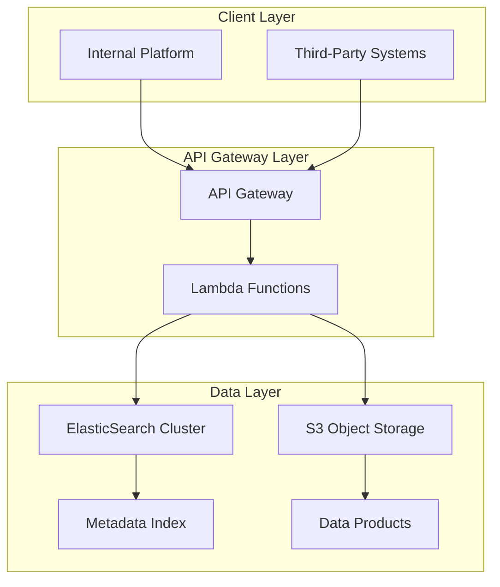

# Digital Data Marketplace: Serverless Architecture for Geospatial Asset Monetization

**Technical Whitepaper**  
**Version 1.0**

---

## Executive Summary

This whitepaper presents the technical architecture of a digital data marketplace platform designed to enable discovery, access, and commercialization of field-collected geospatial and utility infrastructure data. Built on serverless computing principles, the system demonstrates how modern cloud-native patterns can support scalable metadata management while maintaining cost efficiency and operational flexibility.

The platform addresses the fundamental challenge of unlocking value from previously siloed field data by creating a searchable, discoverable metadata layer that connects data producers with consumers across geographic boundaries. Initial deployment in the New Zealand market validates the technical approach and provides insights into broader applicability across multiple jurisdictions.

---

## Context and Problem Definition

### The Data Accessibility Challenge

Organizations operating in utility infrastructure and damage prevention accumulate substantial volumes of field-collected data including ground-penetrating radar outputs, photographic documentation, trial excavation records, and various geospatial datasets. This data holds significant value beyond its original collection purpose, yet remains largely inaccessible due to:

**Discoverability barriers**: Data exists in isolated repositories without unified search capability  
**Access friction**: No standardized mechanism for third parties to identify relevant datasets for specific geographic areas  
**Monetization gaps**: Absence of commercial framework to enable data producers to derive ongoing value from collected assets  
**Integration complexity**: External systems lack efficient methods to query and retrieve relevant data products

Traditional approaches to data sharing rely on manual coordination, bespoke integration efforts, or proprietary file-sharing mechanisms, none of which scale effectively or support commercial transactions.

### Technical Requirements

The solution architecture must satisfy several critical requirements:

1. **Elastic scalability**: System must handle variable query loads without overprovisioning infrastructure
2. **Geographic search**: Support spatial queries to identify data products relevant to specific coordinate boundaries or regions
3. **Metadata richness**: Enable detailed product descriptions while keeping actual data files in cost-efficient storage
4. **Multi-tenancy**: Support multiple data producers and consumers with appropriate access controls
5. **Integration flexibility**: Provide programmatic access for both internal platforms and external third-party systems
6. **Cost optimization**: Minimize infrastructure expenses during periods of low utilization

---

## Technical Architecture

### System Components

The platform implements a three-tier serverless architecture combining event-driven processing, managed search infrastructure, and object storage:



**ElasticSearch Search Engine**  
The metadata management layer utilizes ElasticSearch to provide full-text search, geospatial queries, and aggregation capabilities. ElasticSearch's distributed architecture enables horizontal scaling as metadata volume increases, while its native geographic query support allows clients to search by bounding boxes, radius, or polygon boundaries.

**AWS S3 Object Storage**  
Actual data products reside in S3 buckets organized by data type, collection date, and geographic region. This separation between metadata and data enables cost-efficient storage while maintaining rapid metadata query performance. S3's tiering capabilities allow automatic migration of infrequently accessed data to lower-cost storage classes.

**Serverless Compute Layer**  
API requests route through AWS Lambda functions that execute only during active requests, eliminating idle infrastructure costs. Each function handles specific operations: metadata queries, presigned URL generation for data access, and transaction logging. Lambda's automatic scaling responds to demand spikes without manual intervention.

**API Gateway**  
A managed API Gateway provides authentication, rate limiting, request routing, and monitoring. This abstraction layer protects backend services while providing consistent interface contracts to consumers.

### Data Flow Patterns

The platform supports two primary interaction patterns:

**Discovery Flow**  
1. Client submits geographic query with bounding coordinates and optional filters
2. API Gateway authenticates request and routes to query Lambda
3. Lambda constructs ElasticSearch query incorporating spatial constraints
4. ElasticSearch returns matching metadata records
5. Response includes product identifiers, descriptions, coverage areas, and pricing information

**Access Flow**  
1. Client requests specific data product using identifier from discovery flow
2. Lambda validates authorization and generates time-limited presigned S3 URL
3. Client retrieves data directly from S3 using presigned URL
4. Transaction logged for billing and analytics purposes

This separation between discovery and access optimizes both performance and cost, as expensive data transfers only occur for explicitly requested products.

### Metadata Architecture

The metadata schema balances richness with query performance:

```json
{
  "product_id": "unique_identifier",
  "product_type": "gpr_scan|photo|trial_hole|survey",
  "collection_date": "ISO_8601_timestamp",
  "geographic_bounds": {
    "type": "Polygon",
    "coordinates": [[...]]
  },
  "data_format": "file_extension",
  "file_size_mb": 0.0,
  "collection_method": "string",
  "accuracy_rating": "enumerated_value",
  "producer_id": "data_owner_identifier",
  "access_tier": "public|restricted|private",
  "pricing_model": "free|per_access|subscription"
}
```

ElasticSearch mapping configuration ensures geographic fields support spatial queries while maintaining efficient index size.

---

## Implementation Considerations

### Regional Deployment Strategy

Initial deployment targets the New Zealand market, providing concentrated user base for validation while limiting infrastructure complexity. The architecture inherently supports multi-region expansion through:

- Regional ElasticSearch clusters for latency optimization
- S3 cross-region replication for data durability
- CloudFront distribution for global API access

### Data Producer Integration

Onboarding new data sources requires:

1. **Metadata standardization**: Converting source-specific formats to canonical schema
2. **Quality validation**: Automated checks for coordinate accuracy, file integrity, and completeness
3. **Access control configuration**: Defining visibility and pricing rules per producer preferences
4. **Ingestion automation**: Scheduled or event-driven pipelines to process new collections

The platform provides ingestion SDKs to simplify integration for data producers.

### Consumer Integration Patterns

External systems integrate via RESTful API with standard authentication mechanisms. The platform supports multiple access patterns:

- **Synchronous queries**: Real-time metadata search during user workflows
- **Batch retrieval**: Bulk metadata export for offline analysis
- **Webhook subscriptions**: Event notifications when new data matching criteria becomes available

Internal platforms utilize direct ElasticSearch access for enhanced query flexibility while maintaining the same metadata contracts.

### Cost Management

Serverless architecture provides inherent cost advantages:

- Lambda execution costs scale linearly with request volume
- ElasticSearch cluster size adjusts to metadata volume, not query frequency  
- S3 storage costs remain minimal through lifecycle policies and compression
- No infrastructure costs during idle periods

Preliminary analysis indicates 60-70% cost reduction compared to traditional always-on server infrastructure at current utilization levels.

---

## Risks and Limitations

### Technical Constraints

**Geographic Query Complexity**  
Complex polygon queries against large metadata sets may exceed Lambda timeout thresholds. Mitigation involves query optimization and potential introduction of materialized views for common search patterns.

**Metadata Synchronization**  
Eventual consistency between data ingestion and search availability creates brief windows where newly added products may not appear in queries. Time lag typically measures in seconds but may extend during high-volume ingestion periods.

**Presigned URL Expiration**  
Time-limited access URLs require clients to retrieve data within expiration windows. For large files or slow connections, this may necessitate retry logic or extended expiration periods.

### Operational Considerations

**Data Quality Governance**  
Platform does not inherently validate accuracy of producer-supplied metadata. Establishing quality standards and verification processes remains essential to maintain consumer trust.

**Pricing Model Complexity**  
Supporting multiple pricing models (per-access, subscription, tiered) increases transaction tracking and billing system complexity.

**Dependency on Managed Services**  
Reliance on AWS-specific services creates potential vendor lock-in. While core architecture patterns remain portable, migration to alternative cloud providers would require service substitution efforts.

---

## Conclusion

The digital data marketplace platform demonstrates how serverless architecture patterns enable cost-efficient, scalable infrastructure for metadata-driven discovery and access workflows. By separating metadata management from data storage and utilizing managed cloud services for search and compute, the system achieves operational efficiency while maintaining flexibility for future expansion.

The New Zealand deployment provides validation of technical approach and business model viability. Success in this market establishes foundation for geographic expansion and integration of additional data types. The architecture's modularity supports incremental enhancement without requiring fundamental redesign.

Future evolution may incorporate machine learning for automated metadata enhancement, blockchain-based transaction verification, and expanded integration with external geospatial platforms. The serverless foundation ensures such capabilities can be added without disrupting existing operations or requiring infrastructure overhaul.

This platform represents a strategic investment in data asset monetization, transforming previously static collections into dynamic, discoverable, and commercially valuable products.

---

## Appendix: Key Data Product Types

The platform currently supports metadata and access for:

- **Ground-Penetrating Radar (GPR)**: 3D subsurface scan outputs with depth profiling
- **Photographic Documentation**: Geotagged field imagery with timestamp and location metadata  
- **Trial Hole Records**: Excavation reports with soil composition and utility verification data
- **Survey Data**: Various geospatial measurement and positioning datasets

Each data type maintains type-specific metadata fields while conforming to common geographic and access control schemas.
