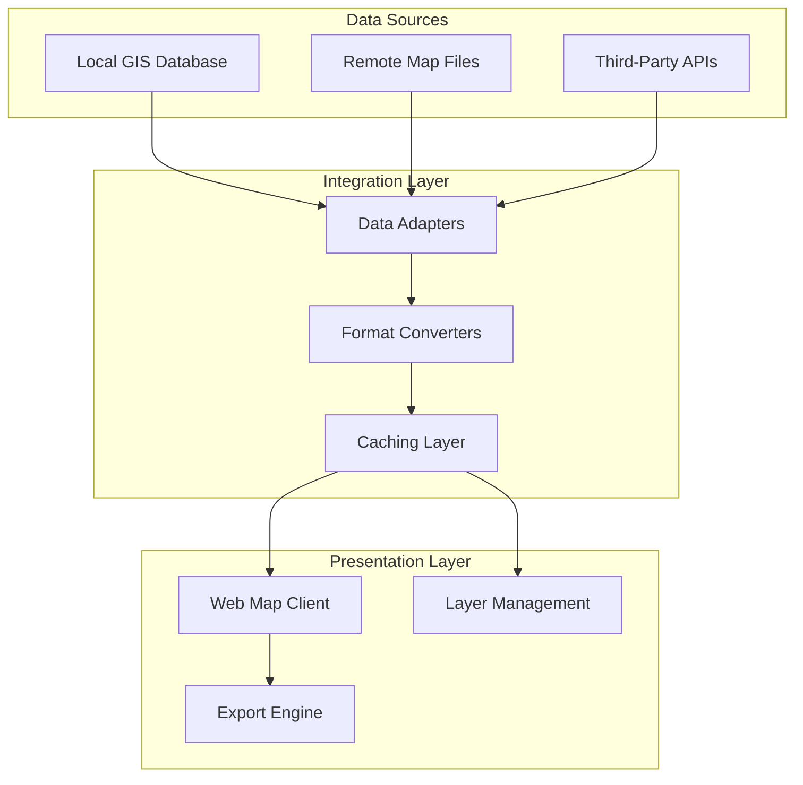

# Interactive Geospatial Portal: Multi-Source Data Integration for Dynamic Map Visualization

**Technical Whitepaper**  
**Version 1.0**

---

## Executive Summary

This whitepaper describes the technical architecture of a proof-of-concept interactive geospatial portal designed to aggregate and visualize spatial data from heterogeneous sources. The system demonstrates how modern web mapping technologies can unify locally hosted datasets, remote file repositories, and third-party API services into a single cohesive user experience that surpasses static document-based data delivery.

The proof-of-concept validates technical feasibility for multi-region deployment while establishing architectural patterns for integrating diverse geospatial information systems. This foundation enables transition from static PDF-based data distribution to dynamic, queryable map interfaces that support enhanced decision-making workflows.

---

## Context and Problem Definition

### The Static Data Limitation

Current geospatial data distribution relies predominantly on static formats, primarily PDF documents containing embedded maps or coordinate listings. This approach creates several operational constraints:

**Limited Interactivity**: Users cannot dynamically query, filter, or overlay multiple data layers  
**Version Control Challenges**: Each update requires new document generation and redistribution  
**Integration Friction**: Downstream systems cannot programmatically extract spatial data for incorporation into design tools or GIS platforms  
**Accessibility Barriers**: Non-technical users struggle to interpret coordinate-heavy documents without specialized software  
**Storage Inefficiency**: Duplicate data exists across multiple document versions without centralized truth source

Organizations operating across multiple geographic markets face compounded challenges as each region maintains separate data repositories, formatting standards, and distribution mechanisms.

### Requirements for Dynamic Visualization

A modern geospatial portal must address these limitations through:

1. **Source Agnosticism**: Integrate data regardless of storage location or format
2. **Real-Time Updates**: Reflect data changes without manual republication cycles
3. **Layer Composition**: Enable users to combine multiple spatial datasets for comprehensive analysis
4. **Export Capability**: Support download in industry-standard formats for use in external tools
5. **Responsive Design**: Function across desktop and mobile devices with appropriate interface adaptation
6. **Regional Customization**: Accommodate jurisdiction-specific data types and visualization preferences

---

## Technical Architecture

### System Overview

The portal implements a three-tier architecture separating data acquisition, transformation, and presentation:

### Data Source Integration

**Local GIS Repositories**  
Internal geospatial databases expose data through OGC-compliant WMS (Web Map Service) and WFS (Web Feature Service) protocols. These standardized interfaces enable the portal to request map tiles or vector features without requiring direct database access or understanding of underlying schema. PostGIS-enabled PostgreSQL databases provide efficient spatial indexing for rapid query response.

**Remote File Systems**  
Static map files (GeoJSON, KML, Shapefile) hosted on remote servers are accessed via HTTP endpoints. The integration layer handles format detection, coordinate system transformation, and feature simplification to optimize client-side rendering performance. Caching strategies reduce redundant network requests for frequently accessed datasets.

**Third-Party API Services**  
External providers offering real-time geospatial data through REST APIs integrate via standardized adapter patterns. Each adapter transforms provider-specific response formats into canonical internal representations, isolating the presentation layer from API variations. Rate limiting and fallback mechanisms ensure system stability during external service disruptions.

### Data Transformation Pipeline

The integration layer performs several critical transformations:

**Coordinate System Normalization**  
Source data may utilize various spatial reference systems (WGS84, regional projections, local grid systems). The transformation pipeline reprojects all geometries to a common reference system, typically WGS84 for web display, using PROJ library routines that maintain sub-meter accuracy.

**Feature Simplification**  
High-resolution vector data containing excessive vertices can overwhelm browser rendering engines. The Douglas-Peucker algorithm reduces geometry complexity while preserving visual fidelity, applying different simplification thresholds based on zoom level.

**Metadata Enrichment**  
Raw spatial data often lacks descriptive attributes necessary for user comprehension. The transformation layer augments features with human-readable labels, category classifications, and attribution information by joining spatial identifiers with external reference tables.

### Caching Architecture

A multi-tier caching strategy balances freshness with performance:

**Browser Cache**: Static assets and infrequently changing layers utilize HTTP cache headers for client-side storage  
**CDN Layer**: Map tiles and common datasets distribute through content delivery networks for geographic latency reduction  
**Application Cache**: Redis-based in-memory cache stores transformed features with configurable time-to-live policies  
**Database Views**: Materialized views pre-compute frequently requested spatial joins and aggregations

Cache invalidation occurs through event-driven notifications when source data updates, ensuring users see current information without excessive refresh overhead.

### Interactive Map Client

The presentation layer utilizes open-source web mapping libraries (Leaflet or OpenLayers) providing:

**Dynamic Layer Control**: Users toggle visibility, adjust transparency, and reorder layers without page reloads  
**Spatial Querying**: Click or area selection triggers attribute queries returning feature properties  
**Measurement Tools**: Distance and area calculation utilities assist with planning and analysis tasks  
**Basemap Selection**: Multiple underlying map styles (street, satellite, topographic) accommodate different use case requirements

The client-side application implements progressive enhancement patterns, delivering core functionality to all browsers while utilizing advanced features where supported.

### Export Capabilities

Users can download visible map extent in multiple formats:

- **GeoJSON**: Native web format compatible with modern GIS tools
- **KML**: Google Earth and mobile mapping applications  
- **Shapefile**: Legacy GIS software requiring Esri compatibility
- **CSV**: Tabular data for spreadsheet analysis
- **PDF**: Static snapshot with scale bar and legend for documentation purposes

Export processing occurs server-side to avoid browser memory limitations when handling large datasets. Asynchronous job queuing manages concurrent export requests without blocking interactive map usage.

---

## Implementation Considerations

### Regional Deployment Strategy

The proof-of-concept targets multi-region applicability with conscious design decisions:

**Jurisdiction-Specific Layers**: Configuration system enables administrators to define region-appropriate data sources without code changes  
**Localization Support**: User interface strings and measurement units adapt to browser language preferences  
**Data Sovereignty**: Regional deployments can enforce data residency requirements by limiting source integration to geographically proximate systems

Initial deployment scenarios target United Kingdom and New Zealand markets, each with distinct data availability and regulatory contexts.

### Performance Optimization

Several techniques ensure responsive user experience:

**Vector Tile Generation**: Pre-computing simplified geometries at multiple zoom levels reduces runtime processing  
**Spatial Indexing**: R-tree indexes on geometry columns accelerate viewport queries  
**Lazy Loading**: Data fetches occur only for visible map extent, not entire datasets  
**Web Workers**: Offloading geometry operations to background threads prevents UI blocking during intensive calculations

Performance monitoring indicates sub-second response times for viewport updates containing thousands of features.

### Security Considerations

Geospatial data often carries sensitivity regarding infrastructure locations:

**Access Control**: Layer-level permissions ensure users only see authorized datasets  
**Redaction Capabilities**: Critical infrastructure coordinates can be generalized or removed from public views  
**Audit Logging**: All data access attempts are logged for security review and compliance purposes  
**API Authentication**: Token-based authentication secures integration endpoints from unauthorized access

---

## Risks and Limitations

### Technical Constraints

**Browser Compatibility**: Older browsers lack support for modern canvas rendering optimizations, potentially degrading performance for complex datasets  
**Mobile Bandwidth**: High-resolution imagery and detailed vector data may exceed reasonable mobile data consumption, requiring adaptive quality settings  
**Coordinate Accuracy**: Transformation between spatial reference systems introduces minor precision loss, potentially problematic for engineering applications requiring millimeter accuracy

### Operational Challenges

**Data Freshness Coordination**: No automated mechanism exists to detect when source systems have updated data, requiring manual cache invalidation or conservative time-to-live policies  
**Format Diversity**: Each new data source may require custom adapter development, increasing maintenance burden  
**Dependency Management**: Reliance on third-party APIs creates availability dependencies outside direct control

### Scalability Considerations

Current proof-of-concept architecture handles hundreds of concurrent users across moderate geographic areas. Scaling to thousands of simultaneous users or national coverage areas would require:

- Horizontal scaling of application servers behind load balancers
- Database read replicas for query distribution  
- Enhanced caching strategies with longer time-to-live periods
- Potential introduction of vector tile services for extremely large datasets

---

## Conclusion

The interactive geospatial portal proof-of-concept demonstrates technical viability of transitioning from static document distribution to dynamic web-based mapping interfaces. The architecture successfully integrates heterogeneous data sources while maintaining performance and usability standards appropriate for production deployment.

Validation across multiple regional contexts confirms the approach's adaptability to varying data availability and organizational requirements. The modular integration layer isolates complexity from end users while providing clear extension points for incorporating additional data sources as they become available.

This foundation establishes several strategic capabilities:

- Improved data accessibility for non-technical users through intuitive map interfaces
- Enhanced decision support through multi-layer spatial analysis
- Reduced operational overhead by eliminating static document generation workflows
- Platform for future advanced capabilities including real-time data overlays and collaborative annotation features

Next phases will focus on production hardening, user acceptance testing across target markets, and integration with existing platform ecosystems. The technical architecture provides sufficient flexibility to accommodate evolving requirements without fundamental redesign.

---

## Appendix: Technology Stack

**Frontend Components**  
- Leaflet 1.9.x: Core mapping library
- OpenLayers (alternative): Advanced cartographic operations
- Turf.js: Client-side spatial analysis

**Backend Services**  
- Node.js/Express: API gateway and adapter services
- PostGIS: Spatial database capabilities
- GeoServer: OGC service implementation

**Infrastructure**  
- Redis: Application caching layer
- CloudFront: Content delivery network
- S3: Static asset hosting