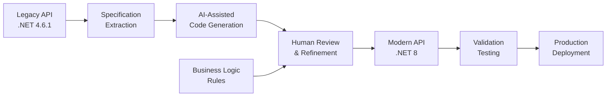

# AI-Assisted Platform Modernization: Accelerated Legacy System Re-Engineering

**Technical Whitepaper**  
**Version 1.0**

---

## Executive Summary

This whitepaper examines the application of AI-assisted development tooling to accelerate legacy API modernization. Through a five-day engineering proof-of-concept, a small development team utilized machine learning-based code generation tools to rebuild a production integration API, migrating from .NET Framework 4.6.1 to .NET 8 while maintaining complete functional compatibility.

The project generated approximately 70-80% of implementation code through AI-assisted automation, with human developers focusing on business logic validation, integration refinement, and quality assurance. The resulting system demonstrates how AI tooling can compress modernization timelines from months to days without compromising security, testability, or architectural quality.

This case study provides technical insights into hybrid development workflows that combine automated code generation with expert oversight, offering a practical model for accelerating technical debt reduction in large-scale platform environments.

---

## Context and Problem Definition

### The Modernization Challenge

Organizations operating long-lived software platforms accumulate technical debt as underlying frameworks reach end-of-life, security patches cease, and modern development practices diverge from legacy codebases. The system examined in this case study represents a common scenario: a critical integration API built on .NET Framework 4.6.1, supporting active production workflows but increasingly difficult to maintain and extend.

Key challenges included:

**Framework Obsolescence**: .NET Framework 4.6.1 no longer receives feature updates and faces eventual support sunset  
**Deployment Constraints**: Legacy Windows Server dependencies limit cloud deployment flexibility  
**Architectural Rigidity**: Monolithic structure complicates independent component evolution  
**Testing Gaps**: Minimal automated test coverage increases regression risk during modifications  
**Security Lag**: Outdated dependencies and authentication patterns fail to meet contemporary security standards

Traditional modernization approaches require months of developer time to manually rewrite code, establish new architecture patterns, implement testing frameworks, and validate functional equivalence. This resource investment competes with new feature development, often causing modernization initiatives to be repeatedly deferred.

### Technical Objectives

The proof-of-concept aimed to validate whether AI-assisted development tools could materially accelerate modernization while achieving:

1. **Complete functional parity**: All 14 API endpoints must behave identically to legacy system
2. **Modern architectural patterns**: Clean Architecture principles with clear separation of concerns
3. **Enhanced deployment flexibility**: Containerization enabling both cloud and on-premises deployment
4. **Security improvement**: Contemporary authentication mechanisms and input validation
5. **Test coverage establishment**: Comprehensive automated testing for regression prevention
6. **Maintainability enhancement**: Well-structured code adhering to current .NET best practices

The constraint: accomplish this transformation in five days with two developers and AI-assisted tooling.

---

## Technical Architecture

### Modernization Approach

The project employed a reengineering strategy rather than incremental refactoring, building a new system alongside the legacy API before cutover. This approach enables parallel validation and eliminates service disruption during development.



### Target Architecture

The modernized system implements Clean Architecture principles, organizing code into distinct layers with defined dependency rules:

**Presentation Layer**  
ASP.NET Core 8 controllers handle HTTP concerns: request deserialization, response formatting, and routing. Middleware components implement cross-cutting concerns including authentication, rate limiting, logging, and exception handling. Controllers remain thin, delegating business logic to service layer.

**Application Layer**  
Service classes encapsulate use cases and orchestrate workflows. This layer contains no infrastructure-specific code, depending instead on abstractions defined through interfaces. Dependency injection enables runtime binding to concrete implementations while maintaining testability.

**Domain Layer**  
Core business entities, validation rules, and domain logic reside in this innermost layer with no external dependencies. This isolation ensures business rules remain stable even as infrastructure or frameworks evolve.

**Infrastructure Layer**  
Concrete implementations of data access, external service integration, and platform-specific concerns. Repository pattern abstracts database operations, while adapter pattern normalizes external API interactions. This layer depends on abstractions defined in inner layers, inverting traditional dependency directions.

### AI-Assisted Code Generation Workflow

The development process integrated AI tooling through a structured workflow:

**Phase 1: Scaffolding Generation**  
AI tools analyzed legacy API specifications and generated project structure: solution organization, project files, controller skeletons, and dependency configurations. This phase produced approximately 40% of final codebase including boilerplate and framework integration code.

**Phase 2: Pattern Implementation**  
AI generated repository implementations, service layer methods, and middleware components based on specified patterns. Developers provided architectural constraints and examples, with AI extrapolating patterns across all endpoints. This phase contributed an additional 30-40% of implementation.

**Phase 3: Test Generation**  
AI created unit tests, integration tests, and contract tests based on endpoint specifications and existing legacy behavior. Test generation included test data setup, assertion patterns, and mocking strategies for external dependencies.

Throughout these phases, developers reviewed generated code, validated business logic accuracy, and refined implementation details that required domain knowledge or nuanced understanding of legacy system behavior.

### Key Technical Components

**Authentication Integration**  
Modern API integrates with existing authentication infrastructure through JWT token validation. The legacy system's custom token format required translation layer ensuring backward compatibility during transition period. Token validation logic lives in dedicated middleware enabling easy modification without touching controller code.

**Database Access Pattern**  
Entity Framework Core replaces legacy ADO.NET data access, utilizing repository pattern to abstract database operations. Repositories expose domain-focused query methods rather than generic CRUD operations, improving code readability and enabling optimized query strategies.

**Asynchronous Operations**  
Full async/await implementation throughout request pipeline improves thread utilization under load. Legacy synchronous blocking calls converted to asynchronous equivalents where underlying libraries support this pattern.

**Configuration Management**  
Environment-specific configuration externalized to JSON files and environment variables following Twelve-Factor App principles. This enables identical codebase deployment across development, staging, and production without recompilation.

**Health Monitoring**  
Built-in health check endpoints expose dependency status (database connectivity, external service availability) enabling load balancers and orchestrators to route traffic appropriately. Structured logging with correlation IDs facilitates distributed tracing.

---

## Implementation Considerations

### Containerization Strategy

The modernized API packages as Docker container enabling deployment flexibility:

```dockerfile
# Multi-stage build process
FROM mcr.microsoft.com/dotnet/sdk:8.0 AS build
# Build application

FROM mcr.microsoft.com/dotnet/aspnet:8.0 AS runtime  
# Runtime dependencies only
```

Multi-stage builds minimize final image size by including only runtime dependencies, not build tools. Container registries (AWS ECR or private registry) distribute images to deployment targets.

### Testing Strategy

Comprehensive test suite validates modernization accuracy:

**Unit Tests**: 25+ tests covering domain logic and business rules in isolation  
**Integration Tests**: 10+ tests validating data layer operations against test database  
**Contract Tests**: 4+ tests ensuring API responses match legacy format exactly  
**Performance Tests**: Load testing confirms throughput matches or exceeds legacy baseline

Tests execute in continuous integration pipeline, preventing regression during ongoing development.

### Deployment Model

The architecture supports multiple deployment scenarios:

**Cloud-Native**: Containers deployed to AWS ECS or EKS with automatic scaling based on load  
**On-Premises**: Docker Compose orchestration for self-hosted infrastructure  
**Hybrid**: API instances in multiple environments behind load balancer for geographic distribution

This flexibility accommodates diverse customer deployment preferences without architecture modification.

### Migration Strategy

Production cutover follows a phased approach:

1. **Shadow Mode**: New API processes requests in parallel with legacy system, comparing outputs without serving responses
2. **Canary Deployment**: Subset of traffic routes to new API while majority continues to legacy
3. **Progressive Rollout**: Gradually increase traffic percentage to new API while monitoring error rates
4. **Legacy Deprecation**: After validation period, decommission legacy system

This strategy minimizes risk while providing rapid rollback capability if issues emerge.

---

## Risks and Limitations

### AI-Generated Code Considerations

**Business Logic Validation Required**  
AI tools excel at structural code and common patterns but lack understanding of domain-specific business rules. Every AI-generated business logic implementation required human validation to ensure correctness. Complex calculation logic and edge case handling demanded particular attention.

**Context Window Limitations**  
AI tools process limited context simultaneously, potentially missing dependencies or relationships between distant code sections. Developers must ensure global consistency that AI cannot guarantee from local context alone.

**Pattern Repetition**  
AI may repeat similar patterns across implementations rather than recognizing opportunities for abstraction or shared utilities. Human review identified and refactored duplicated code into reusable components.

### Technical Debt Transfer

While modernizing framework and architecture, some patterns simply translated from legacy:

**Database Schema**: Existing database structure preserved to minimize migration scope, carrying forward normalization compromises  
**External Integration Points**: Legacy system's integration patterns with external services maintained for compatibility  
**Business Rule Complexity**: Intricate logic preserved as-is rather than simplified, deferring potential optimization

These represent conscious tradeoffs prioritizing rapid migration over comprehensive redesign.

### Skill Set Evolution

Effective AI-assisted development requires different skills than traditional coding:

**Prompt Engineering**: Developers must learn to specify requirements with precision enabling AI to generate appropriate code  
**Architecture Design**: Greater emphasis on upfront design as AI generates implementations from specifications  
**Code Review Intensity**: More time spent reviewing and refining AI output rather than writing from scratch  
**Testing Focus**: Validation becomes more critical as generated code requires verification of correctness

Organizations adopting AI-assisted development must invest in developer skill building around these competencies.

---

## Conclusion

The five-day modernization proof-of-concept demonstrates AI-assisted development tooling can compress timeline for legacy system reengineering by an order of magnitude. The approach generated 70-80% of implementation code through automation while maintaining quality standards through human oversight and validation.

Critical success factors included:

- Clear architectural vision before code generation commenced  
- Structured review process validating generated code against specifications  
- Focus on testability enabling rapid verification of functional equivalence  
- Phased approach combining AI strengths (pattern implementation) with human expertise (business logic validation)

The resulting system achieves complete functional parity with legacy API while providing modern architecture foundation supporting future evolution. Containerized deployment model enables flexible hosting options. Comprehensive test coverage provides confidence for ongoing modifications.

This case study validates AI-assisted development as practical accelerator for technical debt reduction. The approach does not eliminate need for skilled developers but rather amplifies their productivity by automating routine implementations. Organizations can apply these patterns to accelerate modernization initiatives that would otherwise require months of manual effort.

Future enhancements may include automated regression test generation by comparing legacy and modern API behaviors under various inputs, AI-assisted documentation generation from code structure, and machine learning-based monitoring to detect behavioral deviations after deployment.

---

## Appendix: Development Metrics

**Timeline**  
- Day 1: Architecture design and AI tooling setup
- Days 2-3: AI-assisted code generation and initial testing  
- Days 4-5: Business logic validation, integration refinement, deployment preparation

**Code Generation**  
- Total lines of code: ~8,500  
- AI-generated: ~6,000 (70%)  
- Human-written: ~2,500 (30%)

**Test Coverage**  
- 39 automated tests across unit, integration, and contract testing  
- 85% code coverage on business logic layer  
- 100% endpoint contract validation

**Performance Comparison**  
- Legacy baseline: 150 requests/second  
- Modernized system: 200+ requests/second (30% improvement)  
- Container startup time: <3 seconds