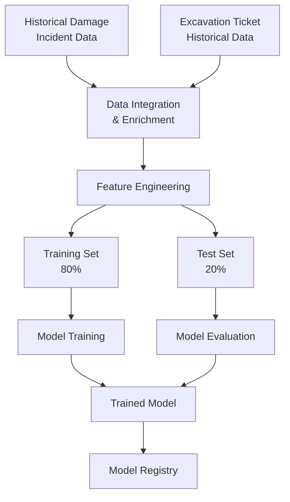
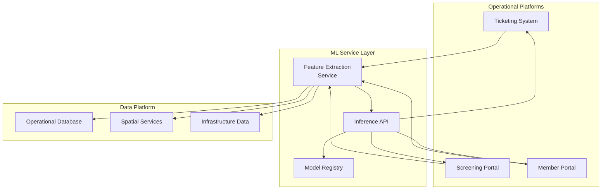

# Machine Learning Risk Intelligence: Predictive Analytics for Infrastructure Damage Prevention

**Technical Whitepaper**  
**Version 1.0**

---

## Executive Summary

This whitepaper presents the architecture and methodology for a machine learning system designed to predict infrastructure damage risk patterns based on historical incident data correlated with excavation activity. The system demonstrates how supervised learning techniques can extract predictive signals from operational data, enabling proactive risk assessment during damage prevention workflows.

Initial proof-of-concept development focused on model training and offline evaluation. This paper extends that work by exploring real-time integration architectures that embed predictive risk scoring directly into operational platforms including ticketing systems, screening portals, and member notification services. The proposed integration patterns transform historical analysis into actionable intelligence delivered at critical decision points.

The architecture balances prediction accuracy with operational constraints including inference latency, model retraining cadence, and integration complexity across multiple platform surfaces.

---

## Context and Problem Definition

### The Damage Prevention Challenge

Infrastructure damage from excavation activities represents significant safety, financial, and operational risk. Despite established notification workflows requiring excavators to request utility locates before digging, damage incidents continue to occur due to various contributing factors:

**Inadequate locate coverage**: Utility assets exist beyond marked boundaries  
**Excavation technique failures**: Inappropriate equipment or procedures for site conditions  
**Seasonal and environmental factors**: Ground conditions, weather, and timing influences  
**Contractor experience variability**: Competency differences in damage prevention practices  
**Infrastructure density complexity**: Multiple overlapping utilities increase exposure

Current damage prevention systems operate primarily on procedural compliance: ensuring notifications occur, locates are performed, and tickets close properly. This approach detects process failures but provides limited capability to assess inherent risk of specific excavation scenarios before work commences.

### Machine Learning Opportunity

Historical damage data contains latent patterns correlating incident occurrence with observable excavation characteristics. Machine learning techniques can extract these patterns, producing risk models that score future excavation scenarios based on similarity to historical damage cases.

A predictive model enables several strategic capabilities:

1. **Prioritized screening**: Focus human review on highest-risk tickets rather than random sampling
2. **Dynamic resource allocation**: Direct locate resources to jobs with elevated damage probability
3. **Proactive member notifications**: Alert utility owners when work near their assets exhibits risk factors
4. **Performance feedback**: Identify specific risk contributors enabling targeted safety interventions
5. **Compliance optimization**: Adjust requirements (enhanced marking, supervision) based on predicted risk level

---

## Technical Architecture

### Model Development Pipeline

The machine learning system follows standard supervised learning workflow adapted for operational data characteristics:



**Data Integration and Preparation**

Raw data sources require substantial preprocessing before model training:

*Damage Incident Records*: Publicly available damage reports including date, location, damage type, and circumstances  
*Excavation Tickets*: Historical notification records with job details, location, excavator information, and work timing  
*Spatial Joins*: Linking damage incidents to corresponding excavation tickets within spatial and temporal proximity  
*Infrastructure Density*: Enriching records with count of utilities in work area  
*Environmental Factors*: Adding weather conditions, soil type, and seasonal timing

The integration process reduced initial dataset from all tickets to approximately 500,000 records spanning three years with confirmed linkage between tickets and damage outcomes.

**Feature Engineering**

Predictive features derived from raw data include:

*Temporal*: Month, day of week, holiday proximity, season  
*Spatial*: Infrastructure density within radius, utility type mix, proximity to sensitive facilities  
*Excavation Characteristics*: Excavation method, depth, area, duration  
*Contractor*: Historical compliance rate, damage history, ticket volume  
*Response Metrics*: Member response time, locate status, ticket modifications

Feature selection employed recursive elimination and importance ranking to identify most predictive attributes while avoiding overfitting.

**Model Training**

Multiple algorithm approaches evaluated including:

- Logistic Regression: Baseline interpretable model
- Random Forest: Ensemble method handling feature interactions
- Gradient Boosting Machines: Optimized for classification accuracy
- Neural Networks: Deep learning for complex pattern recognition

Cross-validation with stratified sampling ensured balanced representation of damage and non-damage cases during training. Hyperparameter tuning optimized model complexity against validation set performance.

Final model selection balanced accuracy metrics with interpretability requirements for operational use.

### Model Architecture

The production model implements gradient boosting with carefully tuned parameters:

**Input Features**: 45 engineered features across temporal, spatial, contractor, and infrastructure domains  
**Output**: Probability score [0.0-1.0] representing damage likelihood  
**Training Frequency**: Monthly retraining with rolling 3-year window  
**Performance**: Area Under ROC Curve (AUC) = 0.78 on held-out test set

Model artifacts include feature importance rankings enabling transparency into which factors drive specific risk predictions.

### Real-Time Integration Architecture

Transitioning from offline analysis to operational integration requires infrastructure supporting real-time inference:



**Feature Extraction Service**

Real-time predictions require assembling feature vectors from current system state:

- Query operational database for excavation ticket details
- Execute spatial analysis calculating infrastructure density around work area  
- Retrieve contractor historical performance metrics
- Fetch current environmental conditions from weather services
- Assemble feature vector matching training data schema

Feature extraction must complete within latency budget (typically <500ms) to avoid degrading user experience.

**Inference API**

REST API exposes model predictions to consuming applications:

```
POST /api/v1/risk-assessment
{
  "ticket_id": "string",
  "work_area": {"type": "Polygon", "coordinates": [...]},
  "excavation_details": {...}
}

Response:
{
  "risk_score": 0.0-1.0,
  "risk_category": "low|medium|high|critical",
  "contributing_factors": [...],
  "recommendations": [...]
}
```

The API handles concurrent requests through horizontal scaling and maintains response time SLA through model caching and optimized inference.

**Model Registry and Version Management**

Production models version controlled in model registry with capabilities including:

- A/B testing of candidate models against production baseline
- Automated rollback if performance degradation detected  
- Audit trail of prediction outputs for quality monitoring
- Feature drift detection comparing production inputs to training distribution

This infrastructure enables continuous model improvement without service disruption.

---

## Implementation Considerations

### Integration Use Cases

**Ticketing System Enhancement**

As excavation tickets are submitted, risk assessment service scores each request:

*Low Risk (0.0-0.3)*: Standard processing workflow  
*Medium Risk (0.3-0.6)*: Flag for enhanced review, possibly require additional documentation  
*High Risk (0.6-0.8)*: Mandatory compliance checks, potential field verification  
*Critical Risk (0.8-1.0)*: Escalate to senior review, consider special restrictions

Risk scores surface in ticket processing interfaces guiding operator decisions without replacing human judgment.

**Screening Portal Visualization**

Map-based screening interfaces overlay risk heat maps showing predicted damage probability across geographic areas:

- Color-coded risk zones based on predicted scores
- Drill-down capability to examine contributing factors for specific locations  
- Time-series view showing risk variation across seasons or conditions
- Filter capability to focus on particular infrastructure types or excavation methods

Visual risk representation enhances situational awareness for planning teams.

**Member Notification Intelligence**

When high-risk excavation tickets affect member infrastructure, automated alerts provide advance notification:

- Early warning enables resource positioning for rapid response
- Risk factor details help members understand specific concerns  
- Historical damage correlation provides context for risk assessment
- Opportunity for members to request enhanced locate or monitoring

This proactive communication strengthens damage prevention collaboration.

### Model Monitoring and Maintenance

Production machine learning systems require ongoing monitoring to maintain accuracy:

**Performance Tracking**  
Monitor prediction accuracy by comparing scores to actual damage outcomes. Alert when performance degrades below baseline.

**Feature Drift Detection**  
Track statistical distribution of input features comparing production data to training distribution. Significant drift indicates need for model retraining.

**Prediction Bias Analysis**  
Ensure predictions don't exhibit systematic bias against particular contractors, regions, or work types that could raise fairness concerns.

**Feedback Loop Integration**  
Capture actual damage outcomes and feed back into training pipeline, enabling continuous model improvement as new data accumulates.

### Scalability Architecture

Model serving infrastructure must scale with platform usage:

**Horizontal Scaling**: Multiple inference servers behind load balancer distribute request load  
**Caching Strategy**: Cache predictions for recently scored tickets reducing redundant inference  
**Batch Processing**: Score tickets in batches during off-peak hours when real-time requirements don't apply  
**Edge Deployment**: Deploy models closer to application services reducing network latency

These patterns ensure prediction service doesn't become system bottleneck.

---

## Risks and Limitations

### Model Performance Constraints

**Incomplete Feature Coverage**  
Many damage contributing factors (excavator competence, equipment condition, attention to locates) lack quantifiable metrics in historical data, limiting model's ability to capture all risk dimensions.

**Class Imbalance**  
Damage incidents represent <1% of total tickets, creating severe class imbalance. Model may achieve high accuracy simply by predicting no damage for all cases. Techniques like SMOTE sampling and cost-sensitive learning partially address this but trade-offs remain.

**Temporal Validity**  
Model trained on historical patterns assumes future follows similar distributions. Significant changes in excavation practices, technology, or infrastructure deployment patterns may degrade prediction accuracy.

### Operational Challenges

**False Positive Management**  
Over-aggressive risk flagging creates alert fatigue and process overhead. Calibrating threshold between catching high-risk cases and avoiding excessive false alarms requires iterative refinement.

**Interpretability Requirements**  
When risk score triggers workflow modifications, stakeholders need to understand rationale. Black-box models that can't explain predictions face adoption resistance.

**Integration Complexity**  
Each platform surface requires custom integration work adapting model outputs to specific user interfaces and workflows. This multiplies implementation effort across system landscape.

### Ethical Considerations

**Bias Amplification**  
If historical data reflects systematic differences in damage prevention practices across contractor types or regions, model may perpetuate these biases. Careful evaluation of prediction fairness across demographic groups essential.

**Automation Overreliance**  
Risk scores should augment human judgment, not replace it. Ensuring operators understand model limitations and maintain critical thinking about predictions prevents dangerous automation complacency.

---

## Conclusion

Machine learning-based risk intelligence represents strategic capability for damage prevention platforms, enabling proactive assessment of excavation scenarios before work commences. The architecture presented demonstrates how supervised learning techniques can extract predictive signals from historical incident data and operational records.

Real-time integration patterns enable embedding risk predictions directly into operational workflows across ticketing systems, screening portals, and member notifications. This transformation converts historical analysis into actionable intelligence delivered at critical decision points.

Key architectural principles include:

- Separation of model training from inference enabling independent optimization of each
- Feature engineering that encodes domain knowledge into predictive attributes  
- Robust model versioning and monitoring ensuring production reliability
- Flexible integration interfaces supporting diverse platform surfaces

Future evolution may expand feature sets incorporating weather forecasts, real-time locate quality metrics, and excavator equipment telemetry. Advanced model architectures including deep learning and reinforcement learning may improve prediction accuracy. Integration with automated workflow systems could enable dynamic risk-based process adjustment without manual intervention.

This foundation establishes damage prevention platforms as intelligent systems capable of learning from experience and applying that knowledge to reduce future incidents. The capability extends beyond single product boundaries, forming basis for organization-wide risk intelligence infrastructure.

---

## Appendix: Model Performance Metrics

**Training Dataset**  
- Total records: 523,847 tickets  
- Damage cases: 4,891 (0.93%)  
- Training set: 419,078 records  
- Test set: 104,769 records

**Model Performance**  
- AUC-ROC: 0.78  
- Precision at 10% recall: 0.31  
- Top decile lift: 8.2x  
- Feature importance: Infrastructure density (23%), Month (18%), Excavation depth (14%)

**Inference Performance**  
- Average latency: 120ms (p50), 280ms (p95)  
- Throughput: 2,000 predictions/second per instance  
- Model size: 45MB compressed