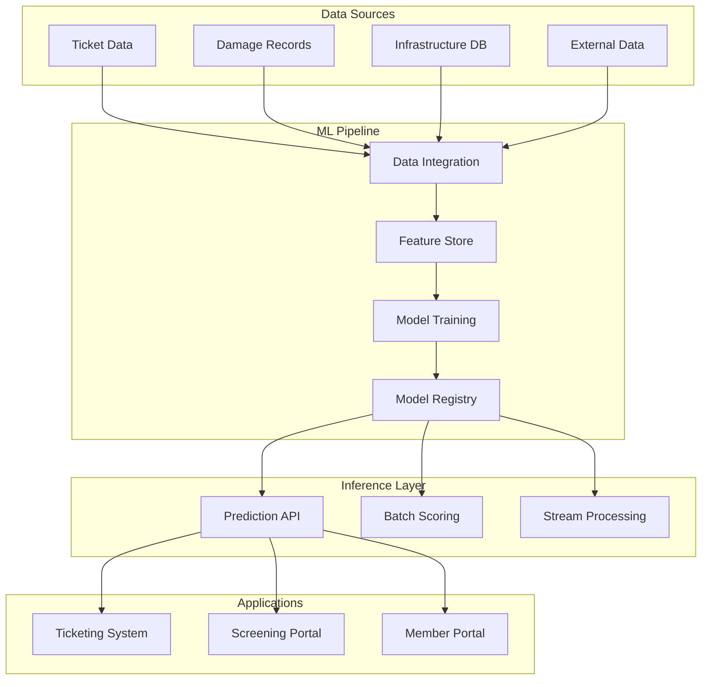

# Innovation Platform Architecture: API-First Design and Intelligence Integration Roadmap

**Technical Whitepaper**  
**Version 1.0**

---

## Executive Summary

This whitepaper outlines a comprehensive technical roadmap for platform modernization centered on API-first architecture, embedded machine learning capabilities, and automation-driven operational efficiency. The initiatives span infrastructure layer improvements, intelligent feature development, and system integration enhancements designed to transform operational platforms into intelligent, data-driven systems.

The roadmap structures initiatives across near-term foundational work and medium-term capability expansion. Each initiative targets specific technical challenges while contributing to cohesive architectural vision: platforms that learn from operational data, expose capabilities through well-defined interfaces, and automate routine processes to improve efficiency and user experience.

This represents strategic investment in platform evolution, establishing technical foundations that enable continuous innovation rather than episodic enhancement.

---

## Context and Problem Definition

### Platform Evolution Imperatives

Organizations operating mature software platforms face several converging pressures driving architectural evolution:

**Technical Debt Accumulation**: Legacy architectures resist modification, slowing feature delivery and increasing maintenance costs  
**Data Silos**: Operational data trapped in application-specific databases limits cross-platform intelligence  
**Manual Process Dependencies**: Workflows requiring human intervention create bottlenecks and scale limitations  
**Integration Complexity**: Point-to-point connections between systems create fragile dependencies  
**Intelligence Gaps**: Systems capture vast operational data but provide limited predictive or prescriptive capabilities

Traditional approaches address these challenges through incremental improvements within existing architectural constraints. This roadmap proposes more fundamental transformation: rebuilding platforms around modern architectural patterns that enable rather than constrain innovation.

### Architectural Vision

The roadmap pursues several interconnected technical objectives:

1. **API-First Design**: Expose all platform capabilities through documented, versioned APIs enabling programmatic access and integration
2. **Intelligence Embedding**: Integrate machine learning models directly into operational workflows providing real-time predictive capabilities
3. **Event-Driven Architecture**: Transition from request-response patterns to event streaming enabling reactive systems and real-time processing
4. **Automation-First Workflows**: Redesign manual processes around automation with human oversight rather than human execution
5. **Data Platform Foundation**: Establish unified data infrastructure supporting analytics, machine learning, and operational queries
6. **Observability by Design**: Build comprehensive monitoring, logging, and tracing into all systems from inception

---

## Technical Architecture

### Foundational Capabilities (Now)

The near-term roadmap establishes technical foundations required for advanced capabilities:

#### Machine Learning Insight Engine

Expansion of risk prediction models to provide comprehensive intelligence across operational domains:

**Architecture Components**

**Feature Store Implementation**  
Centralized feature engineering platform computes, stores, and serves features for both model training and production inference. This ensures consistency between training and serving environments while enabling feature reuse across multiple models.

**Model Deployment Pipeline**  
Automated pipeline for model validation, versioning, deployment, and monitoring. Includes A/B testing framework comparing candidate models against production baselines before full rollout.

**Multi-Model Architecture**  
Rather than single monolithic model, system deploys specialized models for specific prediction tasks: damage risk assessment, ticket classification, anomaly detection, and workload forecasting. This enables independent optimization and evolution of each model.

#### Digital Mapping Enhancement

Evolution of geospatial visualization capabilities supporting advanced spatial analysis:

**Technical Improvements**

*Vector Tile Service*: Pre-generated vector tiles at multiple zoom levels replace dynamic feature rendering, improving performance for complex geometries  
*Spatial Analysis APIs*: Expose geographic query capabilities (buffer, intersection, proximity) as services consumable by external systems  
*Real-Time Data Streams*: WebSocket connections enable live updates as infrastructure data changes without requiring page refreshes  
*3D Visualization Support*: WebGL-based rendering for elevation-aware infrastructure visualization

These capabilities transform mapping from static display to interactive analysis platform.

#### API Governance and Control

Implementation of comprehensive API management infrastructure:

**Rate Limiting and Throttling**  
Token bucket algorithm enforces per-client request limits preventing resource exhaustion from abusive or misconfigured integrations. Limits differentiate by client tier enabling premium access levels.

**API Gateway Deployment**  
Unified gateway provides authentication, authorization, request routing, response transformation, and monitoring across all platform APIs. This abstraction layer enables API evolution without breaking existing integrations.

**Contract Testing Framework**  
Automated validation ensuring API responses conform to published specifications. Tests execute in continuous integration preventing accidental breaking changes.

**Documentation Generation**  
OpenAPI specifications automatically generated from code annotations ensure documentation accuracy and eliminate manual synchronization overhead.

#### Support Cost Attribution

Data pipeline correlating support tickets with product versions and customer configurations:

**Architecture**

*JIRA Integration*: Bidirectional sync between support system and product database extracting version information from customer records  
*Analytics Pipeline*: ETL process joins support tickets with release metadata calculating support volume by version  
*Dashboard Generation*: Automated reporting showing support cost trends relative to product releases

This data quantifies quality improvement impact enabling evidence-based prioritization of technical debt reduction.

### Advanced Capabilities (Next)

Medium-term initiatives build on foundational infrastructure:

#### Reporting Enhancements

Expansion of analytical capabilities embedded in member portals:

**Self-Service Analytics**  
Configurable dashboard framework enabling users to build custom reports without developer intervention. Supports drag-drop metric selection, filter composition, and visualization configuration.

**Query Optimization**  
Materialized views and columnar storage for frequently accessed aggregations. Query planner analyzes patterns and pre-computes results for common report types.

**Export Automation**  
Scheduled report generation and distribution eliminating manual report production workflows. Supports multiple output formats and delivery mechanisms.

#### AI-Powered Analysis

Integration of large language models for pattern recognition and root cause analysis:

**Log Analysis**  
Automated scanning of application logs, system events, and error traces identifying anomalies, grouping related issues, and suggesting potential causes. Reduces mean time to resolution for operational incidents.

**Ticket Classification**  
Automatic categorization of incoming tickets by type, priority, and routing destination using natural language processing. Improves response time and resource allocation.

**Knowledge Base Enhancement**  
AI-assisted documentation search and question answering over technical knowledge bases. Helps support teams rapidly locate relevant information.

#### Event Notification System

Real-time event streaming infrastructure for ticket lifecycle events:

**Architecture**

Pub/sub messaging system (Kafka or AWS SNS/SQS) broadcasts ticket state changes to subscribed consumers. External systems register webhooks receiving notifications when conditions match their subscription criteria.

**Event Schema**  
Standardized JSON event format includes: event type, timestamp, ticket identifier, previous state, new state, and relevant metadata. Schema versioning enables backward-compatible evolution.

**Delivery Guarantees**  
At-least-once delivery with idempotency keys enabling consumers to safely process duplicate events. Dead letter queues capture failed delivery attempts for investigation.

#### Performance Infrastructure

Geographic distribution of mapping services:

**GeoServer Clustering**  
Multiple GeoServer instances across regions serving map tiles with geographic load balancing. Improves latency for international users while providing resilience against regional failures.

**CDN Integration**  
Static tiles and frequently accessed vector data cache at edge locations worldwide. Reduces origin server load and minimizes latency for cached content.

**Dynamic Tile Generation**  
On-demand tile rendering for rarely accessed map extents avoids pre-generating entire coverage area. Balances storage costs against rendering latency.

---

## Implementation Considerations

### Phased Rollout Strategy

Complex architectural changes deploy through careful phasing:

**Phase 1: Parallel Operation**  
New capabilities operate alongside existing systems without replacing them. Users can opt-in to new features while fallback to legacy remains available.

**Phase 2: Progressive Migration**  
Gradually transition workloads from legacy to modern systems. Monitor performance and quality metrics at each step, ready to rollback if issues emerge.

**Phase 3: Legacy Deprecation**  
After validation period, decommission replaced systems. Ensure clear communication to stakeholders about timeline and implications.

### Integration Architecture

New capabilities must integrate with existing platform ecosystem:

**Message Bus**  
Central event broker enables loose coupling between systems. Components publish events without knowing consumers, enabling flexible integration patterns.

**Shared Data Services**  
Common services for authentication, authorization, configuration, and operational data access prevent duplicate implementation across initiatives.

**API Contracts**  
Well-defined interfaces with semantic versioning enable independent evolution of components without breaking dependencies.

### Operational Readiness

Production deployment requires comprehensive operational support:

**Monitoring and Alerting**  
Metrics, logs, and traces exported to observability platform. Automated alerting on anomalies, errors, and performance degradation.

**Runbooks and Procedures**  
Documented operational procedures for common scenarios: deployments, incidents, scaling events, and disaster recovery.

**Capacity Planning**  
Forecasting tools predicting resource requirements based on usage trends. Proactive scaling before constraints become incidents.

---

## Risks and Limitations

### Technical Risks

**Integration Complexity**  
Coordinating multiple simultaneous initiatives across shared platforms creates integration challenges. Clear interface contracts and coordination protocols essential to prevent conflicts.

**Performance Impact**  
Adding intelligence layers and event processing introduces latency. Careful optimization and caching strategies required to maintain user experience.

**Dependency Management**  
Shared infrastructure creates dependencies between initiatives. Failure or delay in foundational components cascades to dependent projects.

### Resource Constraints

**Skill Availability**  
Advanced capabilities require specialized skills (machine learning, distributed systems, cloud architecture) that may not exist in current team composition.

**Opportunity Cost**  
Innovation investment competes with maintenance, support, and feature development for existing products. Balance required between future capability building and current customer needs.

**Technical Debt**  
Existing technical debt slows new capability integration. Addressing legacy systems may require more effort than anticipated.

### Adoption Challenges

**Change Management**  
Users accustomed to existing workflows may resist new capabilities. Training, communication, and phased rollout help manage transition.

**Integration Partners**  
External systems integrating via APIs must adapt to new capabilities and versioning. Backward compatibility and migration support essential.

---

## Conclusion

The innovation roadmap represents strategic technical investment transforming operational platforms into intelligent, API-driven systems. Foundational initiatives establish infrastructure required for advanced capabilities while providing immediate value through enhanced performance, improved monitoring, and better integration support.

The architecture pursues several interconnected objectives: intelligence embedding through machine learning integration, automation of manual processes, API-first design enabling programmatic access, and data platform consolidation supporting analytics and operations.

Success requires careful orchestration across multiple initiatives, balancing ambition with practical execution constraints. Phased rollout, robust testing, and comprehensive monitoring ensure production stability during transformation.

The roadmap establishes technical foundation for continuous innovation rather than episodic enhancement. API-first design enables rapid integration of new capabilities. Event-driven architecture supports reactive systems. Machine learning infrastructure allows ongoing model deployment and improvement.

This represents not just technical modernization but fundamental evolution in how platforms operate: from manual to automated, from reactive to predictive, from isolated to integrated. The resulting capabilities position the organization for sustained competitive advantage through technical excellence.

---

## Appendix: Initiative Summary

**Foundational (Now)**
- ML Insight Engine: Risk prediction model expansion and production integration
- Digital Mapping: Enhanced geospatial visualization and analysis  
- API Governance: Rate limiting, monitoring, and contract testing
- Support Attribution: Cost correlation pipeline and analytics

**Advanced (Next)**  
- Reporting Enhancement: Self-service analytics and query optimization
- AI Analysis: Log pattern recognition and automated classification
- Event Notifications: Real-time streaming for ticket lifecycle events  
- Performance Infrastructure: Geographic distribution and CDN integration

**Cross-Cutting Concerns**
- Observability: Comprehensive monitoring, logging, and tracing
- Security: Authentication, authorization, and data protection
- Scalability: Horizontal scaling and load distribution  
- Reliability: Fault tolerance and disaster recovery