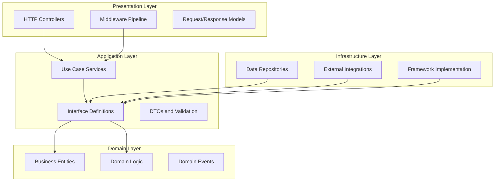

# Clean Architecture Implementation: Modern API Design Patterns and Containerization

**Technical Whitepaper**  
**Version 1.0**

---

## Executive Summary

This whitepaper provides detailed technical examination of modern API architecture implemented during accelerated platform modernization initiative. The system employs Clean Architecture principles, separating concerns across distinct layers with well-defined dependency rules, enabling testability, maintainability, and independent evolution of system components.

Built on .NET 8 with comprehensive containerization, the architecture demonstrates how contemporary framework capabilities can address common challenges in enterprise API development: security, observability, testing, and deployment flexibility. The design supports multiple hosting environments including cloud platforms and on-premises infrastructure without code modification.

This paper serves as both documentation of specific implementation and reference architecture for future modernization efforts, demonstrating practical application of architectural patterns to production systems.

---

## Context and Problem Definition

### Legacy Architecture Limitations

The previous API implementation exhibited characteristics typical of systems developed prior to modern architectural pattern adoption:

**Monolithic Structure**: Business logic, data access, and presentation concerns intermingled within single-layer architecture making isolated component testing difficult and modifications risky

**Framework Coupling**: Direct dependencies on ASP.NET Framework types throughout codebase prevented framework evolution and complicated testing

**Deployment Rigidity**: Compiled artifacts targeting Windows Server environment with IIS hosting required specific infrastructure configuration limiting deployment flexibility

**Security Fragmentation**: Authentication, authorization, and input validation scattered across codebase rather than centralized in reusable components

**Testing Gaps**: Minimal automated test coverage due to tight coupling between components and infrastructure dependencies

**Configuration Management**: Environment-specific settings embedded in compiled code or configuration files requiring recompilation or file modification for environment changes

These limitations accumulated over system lifetime, increasing maintenance burden and constraining ability to adopt modern development practices and deployment patterns.

### Modernization Objectives

The architectural redesign targeted several specific improvements:

1. **Separation of Concerns**: Clear boundaries between presentation, business logic, and data access enabling independent component evolution
2. **Testability**: Architecture supporting comprehensive automated testing without requiring full system deployment
3. **Framework Independence**: Business logic isolated from framework-specific types enabling future migration flexibility
4. **Deployment Flexibility**: Containerized deployment supporting multiple hosting environments without architecture modification
5. **Security Centralization**: Authentication, authorization, and protection mechanisms implemented as reusable middleware
6. **Observability**: Comprehensive logging, health monitoring, and diagnostic capabilities built into architecture from inception

---

## Technical Architecture

### Clean Architecture Layers

The system organizes into four concentric layers with dependency rules enforced through project structure and interface abstraction:

**Domain Layer (Innermost)**

Contains core business entities, value objects, and domain logic with zero external dependencies. This layer defines the system's fundamental concepts and business rules without reference to databases, frameworks, or external services.

Domain entities encapsulate behavior through methods rather than exposing data as public properties. This ensures business invariants are maintained and prevents invalid state transitions. Domain events represent significant occurrences enabling loose coupling between domain concepts.

**Application Layer**

Orchestrates business workflows by coordinating domain entities and infrastructure services. This layer contains use case implementations: the specific operations the system supports. Application services depend only on domain entities and interface abstractions, not concrete infrastructure implementations.

Dependency injection provides infrastructure implementations at runtime, enabling testing with mock objects. Application layer remains stable even as infrastructure details evolve, protecting business logic from technology changes.

**Infrastructure Layer**

Implements interfaces defined in application layer using specific technologies: Entity Framework for data access, HTTP clients for external API integration, file system access for document storage. Infrastructure components translate between domain concepts and external system representations.

Repository pattern abstracts data access, providing domain-focused query methods rather than exposing underlying database structure. This enables database technology changes without modifying application logic.

**Presentation Layer (Outermost)**

ASP.NET Core controllers handle HTTP concerns: request parsing, authentication validation, response serialization. Controllers invoke application services passing validated input and transforming service outputs into HTTP responses.

Middleware pipeline implements cross-cutting concerns: authentication, rate limiting, exception handling, logging. This prevents duplication across endpoints and ensures consistent behavior.

### Key Design Patterns

Several patterns enable the layered architecture:

**Dependency Inversion**

High-level modules (application services) depend on abstractions (interfaces) rather than concrete implementations (infrastructure). Low-level modules implement these abstractions, inverting traditional dependency direction. This enables changing infrastructure details without modifying business logic.

**Repository Pattern**

Data access abstracted behind repository interfaces providing domain-focused query methods. Repositories encapsulate ORM details, query optimization, and connection management, presenting simplified interface to application layer.

**Unit of Work Pattern**

Database transactions managed through unit of work abstraction coordinating multiple repository operations. Ensures changes commit or rollback atomically maintaining data consistency.

**Command Query Responsibility Segregation (CQRS)**

Separate models and handlers for command operations (writes) versus query operations (reads). Enables independent optimization of each operation type and clearer separation of concerns.

### Modern .NET 8 Features

The architecture leverages contemporary framework capabilities:

**Native Dependency Injection**

Built-in DI container manages component lifetime and dependency resolution. Configuration defines service registrations mapping interfaces to implementations. Constructor injection provides dependencies to consuming classes enabling testing with mock objects.

**Async/Await Throughout**

Asynchronous operations from controllers through services to data access avoid thread blocking. This improves throughput under concurrent load as threads can process other requests while waiting for I/O operations.

**Minimal API Hosting**

Streamlined startup configuration reduces boilerplate. Program.cs defines middleware pipeline, service registration, and configuration loading in concise, readable format.

**Source Generators**

Compile-time code generation for serialization and validation eliminates runtime reflection overhead improving performance and enabling ahead-of-time compilation.

**Record Types**

Immutable data transfer objects defined as records provide value equality semantics and concise syntax. Records particularly appropriate for API request/response models that should not change after creation.

**Nullable Reference Types**

Compiler-enforced null safety prevents null reference exceptions through static analysis. Properties that may be null explicitly declared as nullable forcing consumers to check before dereferencing.

### Security Architecture

Multiple layers provide defense in depth:

**Authentication Middleware**

JWT token validation occurs in middleware before request reaches controllers. Tokens verified against trusted issuer using asymmetric cryptography. Invalid or expired tokens rejected with 401 response before entering application logic.

**Authorization Policies**

Role and permission-based policies declared in startup configuration. Attributes on controller methods specify required policies. Framework automatically enforces authorization rules returning 403 when user lacks required permissions.

**Input Validation**

Request models implement validation rules using FluentValidation library. Validation occurs automatically during model binding before controller method executes. Invalid input triggers 400 response with detailed error information.

**Rate Limiting**

Token bucket algorithm implemented in middleware enforces per-client request limits. Configuration defines bucket capacity and refill rate. Excessive requests receive 429 response with retry-after header.

**Security Headers**

Middleware adds OWASP-recommended security headers: Content Security Policy, X-Frame-Options, Strict-Transport-Security. These mitigate common web vulnerabilities including cross-site scripting and clickjacking.

### Observability Implementation

Comprehensive monitoring built into architecture:

**Structured Logging**

Serilog library provides structured logging with rich contextual data. Log entries include correlation IDs enabling request tracing across distributed systems. Logs export to centralized aggregation platform for analysis.

**Health Checks**

Built-in health check middleware exposes endpoints reporting component status: database connectivity, external service availability, disk space. Load balancers and orchestrators query health endpoints routing traffic only to healthy instances.

**Metrics and Tracing**

OpenTelemetry instrumentation exports metrics (request counts, latency distributions, error rates) and distributed traces. This enables performance analysis and troubleshooting in production environments.

**Application Insights**

Integration with Azure Application Insights (when deployed to Azure) provides automatic anomaly detection, dependency mapping, and performance profiling.

---

## Implementation Considerations

### Containerization Strategy

Docker containerization enables deployment portability:

**Multi-Stage Build**

Dockerfile implements multi-stage build separating compilation from runtime:

Stage 1 uses SDK image containing build tools, compiles application, runs tests  
Stage 2 uses runtime image containing only execution dependencies, copies compiled artifacts

Final image contains minimal dependencies reducing attack surface and image size (typically <150MB).

**Configuration Management**

Environment variables override default configuration enabling same container image deployment across environments. Secrets injected via container orchestrator secrets management rather than embedded in images.

**Image Registry**

Built images push to container registry (AWS ECR, Azure ACR, or private registry). Deployment orchestrators pull images from registry for execution. Registry provides versioning, scanning for vulnerabilities, and access control.

### Deployment Patterns

Architecture supports multiple deployment scenarios:

**Cloud-Native (AWS ECS/EKS)**

Containers deploy to managed container services with automatic scaling based on CPU/memory utilization or request metrics. Load balancers distribute traffic across container instances. Service mesh provides traffic management and observability.

**On-Premises (Docker Compose)**

Docker Compose orchestrates multi-container deployment for self-hosted infrastructure. Compose file defines services, networks, and volumes. Updates deploy through docker-compose pull and restart.

**Hybrid (Multiple Regions)**

Containers deploy to multiple geographic regions for latency reduction and disaster recovery. DNS routing directs users to nearest healthy region. Database replication maintains data consistency across regions.

### Testing Strategy

Layered architecture enables comprehensive testing:

**Unit Tests (25+)**

Test domain logic and application services in isolation using mock implementations of dependencies. Fast execution (milliseconds) enables running entire suite frequently during development. Tests validate business rules, calculations, and workflow orchestration.

**Integration Tests (10+)**

Test repository implementations and external integrations against real dependencies (test database, external API stubs). Verify data access logic, transaction handling, and integration contract compliance. Slower than unit tests but provide confidence in infrastructure layer.

**Contract Tests (4+)**

Validate API responses match published OpenAPI specifications. Ensure no breaking changes introduced during modifications. Tests execute against running API instance comparing responses to schema definitions.

**Performance Tests**

Load testing validates throughput and latency under stress. Identifies bottlenecks and validates scaling behavior. Typically executed in staging environment before production deployment.

### Database Migration Strategy

Schema changes managed through versioned migration scripts:

Entity Framework migrations generate SQL scripts from model changes. Scripts committed to source control and reviewed before execution. Automated deployment pipeline applies pending migrations during deployment. Rollback procedures restore previous schema version if issues arise.

---

## Risks and Limitations

### Architectural Trade-offs

**Increased Complexity**

Clean Architecture introduces more projects, interfaces, and abstraction layers than monolithic approach. This complexity justified by benefits (testability, maintainability) but creates learning curve for developers unfamiliar with pattern.

**Indirection Overhead**

Multiple abstraction layers introduce indirection potentially impacting performance. In practice, overhead negligible compared to network and database latency, but could matter in extremely high-throughput scenarios.

**Over-Engineering Risk**

Elaborate architecture may be excessive for simple APIs with minimal business logic. Pattern suitability depends on system complexity and longevity expectations.

### Operational Considerations

**Container Orchestration Learning**

Teams unfamiliar with container operations face learning curve for deployment, monitoring, and troubleshooting. Investment in training and documentation essential for successful adoption.

**Dependency Management**

Containerized applications package all dependencies reducing deployment conflicts but increasing responsibility for dependency updates and vulnerability patching.

**State Management**

Containerized applications should be stateless enabling arbitrary instance scaling and replacement. Applications requiring state must externalize to databases or caching services.

---

## Conclusion

The modernized API architecture demonstrates practical application of Clean Architecture principles to enterprise system modernization. Strict separation of concerns across layers, dependency inversion, and comprehensive abstraction enable testability, maintainability, and deployment flexibility while supporting current operational requirements.

Modern .NET 8 features including native dependency injection, async/await, and minimal hosting provide foundation for implementing architectural patterns without excessive boilerplate. Containerization enables flexible deployment across cloud and on-premises infrastructure with consistent behavior.

Security implementation through layered middleware, comprehensive observability through structured logging and health checks, and extensive automated testing provide production-grade reliability. The architecture balances idealistic architectural purity with pragmatic engineering considerations.

This implementation serves as reference for future modernization efforts, demonstrating that sophisticated architecture patterns can be achieved rapidly through combination of AI-assisted code generation and expert oversight. The resulting system provides solid foundation for ongoing feature development and system evolution.

Key architectural principles applicable beyond this specific implementation:

- Dependency flows inward toward domain layer ensuring business logic remains stable
- Infrastructure concerns isolated behind abstractions enabling technology evolution
- Comprehensive testing enabled through dependency injection and interface abstractions  
- Security and observability implemented as cross-cutting concerns in middleware
- Deployment flexibility through containerization and environment-based configuration

Organizations facing similar modernization challenges can adapt these patterns to their context, achieving similar benefits through disciplined application of architectural principles.

---

## Appendix: Architecture Validation Metrics

**Code Organization**
- Projects: 5 (Domain, Application, Infrastructure, API, Tests)
- Layers properly isolated: Yes  
- Circular dependencies: None
- Interface abstractions: 12

**Test Coverage**  
- Unit tests: 25
- Integration tests: 10
- Contract tests: 4  
- Total code coverage: 85% (business logic layer)

**Performance Characteristics**
- Startup time: <3 seconds
- Request latency (p50): 45ms  
- Request latency (p95): 120ms
- Throughput: 200+ requests/second per instance

**Container Metrics**
- Image size: 142MB  
- Build time: 90 seconds
- Memory footprint: 180MB (idle), 350MB (load)