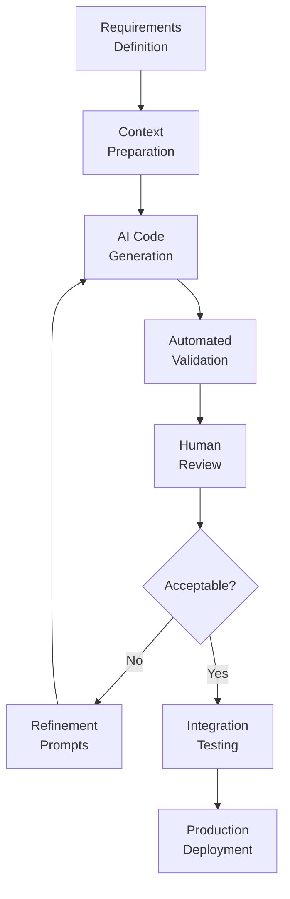

# AI-Assisted Development: Engineering Workflows, Best Practices, and Organizational Integration

**Technical Whitepaper**  
**Version 1.0**

---

## Executive Summary

This whitepaper synthesizes technical and organizational learnings from AI-assisted software modernization initiative, examining the workflow patterns, validation strategies, and skill transformations required for successful integration of machine learning-based development tools into engineering practices.

The analysis distinguishes between automation strengths (pattern implementation, structural code generation, test scaffolding) and domains requiring human expertise (business logic validation, architectural decisions, integration refinement). Understanding this division enables organizations to optimize task allocation between AI tools and engineers, maximizing productivity gains while maintaining quality standards.

The paper proposes repeatable framework for AI-assisted development including context preparation techniques, review workflow patterns, and continuous improvement practices. These patterns generalize beyond specific tools or technologies, providing blueprint for organizations exploring AI integration into software engineering processes.

---

## Context and Problem Definition

### The AI-Assisted Development Landscape

Recent advances in large language models trained on code repositories enable new generation of development assistance tools capable of generating substantial implementations from specifications. These tools demonstrate particular effectiveness in:

**Structural Code Generation**: Creating project scaffolding, class hierarchies, and boilerplate implementations  
**Pattern Application**: Implementing common design patterns consistently across codebase  
**Test Generation**: Producing unit tests, integration tests, and test data fixtures  
**Documentation Creation**: Generating code comments, API documentation, and architectural descriptions

However, these tools exhibit limitations in:

**Business Context Understanding**: Lack domain knowledge about specific organizational processes and rules  
**Global Optimization**: Inability to recognize cross-component opportunities for abstraction or refactoring  
**Subjective Design Decisions**: Cannot evaluate trade-offs requiring judgment about maintainability, performance, or user experience  
**Security and Compliance**: May generate code that compiles but violates security best practices or regulatory requirements

### Hybrid Workflow Opportunity

Optimal outcomes emerge from workflows strategically allocating tasks between AI automation and human expertise. The modernization initiative validated this hypothesis through practical application: AI generated approximately 70-80% of implementation code, with engineers focusing remaining effort on validation, refinement, and integration.

This division enabled accelerated delivery (5 days instead of months) while maintaining quality standards through disciplined review processes. Understanding factors driving this success enables replication across future initiatives.

---

## Technical Architecture of AI-Assisted Workflows

### Development Pipeline Structure

Effective AI-assisted development follows structured workflow integrating automation with human oversight:

**Context Preparation Phase**

AI tools generate higher quality output when provided comprehensive context:

*Architectural Specifications*: Document desired patterns, layer structure, and dependency rules  
*Sample Implementations*: Provide examples of desired coding style, naming conventions, and patterns  
*Business Rules*: Explicit enumeration of domain logic, calculation formulas, and validation rules  
*Integration Contracts*: Specifications of external dependencies including APIs, databases, and services  
*Test Expectations*: Description of required test coverage including edge cases and error conditions

Investing effort in detailed context preparation yields superior AI-generated implementations requiring less refinement iteration.

**AI Generation Phase**

Tool invocation with prepared context produces initial implementations. Modern AI assistants support various interaction models:

*Autonomous Agents*: Tools operating independently over extended periods generating complete implementations  
*Interactive Assistance*: Conversational interface where developer and AI collaborate iteratively  
*Code Completion*: Context-aware suggestions during manual coding accelerating specific implementation tasks

The initiative primarily utilized autonomous agent model, enabling overnight code generation while developers focused on other activities.

**Validation Phase**

Multi-layered validation ensures generated code meets quality standards:

*Compilation*: Code must build successfully without syntax errors  
*Static Analysis*: Linting tools verify adherence to style guidelines and identify potential bugs  
*Security Scanning*: Automated tools detect common vulnerabilities and unsafe patterns  
*Test Execution*: Generated tests must pass validating basic functionality  
*Performance Profiling*: Basic performance metrics ensure no obvious inefficiencies

Automated validation filters out clearly problematic implementations before human review investment.

**Human Review Phase**

Engineers apply expertise AI tools lack:

*Business Logic Verification*: Validate calculations, workflows, and rules match specifications  
*Integration Correctness*: Ensure generated code properly integrates with existing systems  
*Security Hardening*: Identify subtle security issues automated tools miss  
*Performance Optimization*: Refine implementations that function correctly but inefficiently  
*Code Quality*: Improve structure, naming, and maintainability beyond functional correctness

Review typically requires 20-30% of total development time compared to 70-80% for traditional manual implementation, representing significant efficiency gain.

### Effective Prompting Strategies

AI output quality correlates strongly with prompt quality. Effective prompting techniques include:

**Specificity Over Generality**

Vague prompts like "create user service" produce generic implementations. Specific prompts like "create user service implementing repository pattern with Entity Framework Core, async methods, and validation using FluentValidation" yield targeted implementations matching architectural requirements.

**Example-Driven Specification**

Providing one example of desired pattern enables AI to extrapolate across similar cases. For instance, single well-implemented endpoint serves as template for generating remaining endpoints maintaining consistent style.

**Incremental Complexity**

Starting with simplified version then iteratively adding complexity produces better results than attempting full complexity immediately. Generate basic CRUD operations, validate correctness, then layer in security, caching, and advanced features.

**Constraint Declaration**

Explicitly stating constraints prevents invalid implementations: "must not use Entity Framework directly in controllers, only through repository interfaces" or "all database operations must be async and return Task types."

**Test-Driven Specification**

Describing desired behavior through test cases often produces more accurate implementations than natural language specifications. AI can generate implementation satisfying specified tests.

### Review Workflow Patterns

Human review effectiveness depends on systematic approach:

**Layered Review Strategy**

Review in multiple passes focusing on different aspects:

1. *Structural Review*: Verify correct layering, dependency flow, and architectural pattern adherence
2. *Functional Review*: Validate business logic correctness against specifications  
3. *Security Review*: Examine authentication, authorization, input validation, and data protection
4. *Performance Review*: Identify potential bottlenecks, inefficient queries, or resource leaks  
5. *Maintainability Review*: Assess code clarity, naming, and documentation quality

Focused passes enable deeper analysis than attempting simultaneous evaluation of all dimensions.

**Differential Review**

When AI updates previously reviewed code, examining only changes (diff) rather than entire file improves efficiency. Version control integration enables rapid identification of modifications.

**Automated Assistance**

Tools can augment human review:

*Code Coverage Reports*: Identify untested code paths requiring additional tests  
*Complexity Metrics*: Flag methods exceeding complexity thresholds suggesting refactoring need  
*Duplicate Detection*: Highlight repeated code patterns indicating missed abstraction opportunities  
*Performance Profilers*: Measure actual performance identifying optimization priorities

### Integration and Testing

Generated code must integrate smoothly with existing systems:

**Interface Compatibility Validation**

Verify generated implementations correctly implement required interfaces with proper signatures, error handling, and behavior. Contract tests automate this validation.

**Data Flow Testing**

End-to-end tests validate data flows correctly through all layers from presentation through domain to infrastructure and back. These tests catch integration issues unit tests miss.

**Production Parity**

Test in environment closely resembling production including similar data volumes, network latency, and resource constraints. Generated code may perform adequately in local development but fail under production conditions.

---

## Implementation Considerations

### Organizational Integration

Successful AI-assisted development requires organizational support beyond tooling:

**Developer Training**

Engineers need skills in:

*Effective Prompting*: Crafting specifications AI tools can interpret correctly  
*Architectural Design*: Defining structure and patterns AI should implement  
*Code Review*: Rapidly assessing generated implementations for correctness and quality  
*AI Tool Operation*: Understanding capabilities, limitations, and optimal usage patterns

Training programs should include hands-on exercises with real codebases not just theoretical instruction.

**Process Adaptation**

Traditional development processes require modification:

*Story Estimation*: AI-assisted development completes implementations faster but may increase review time. Estimation models must adjust.  
*Code Review Standards*: Review checklists should explicitly address AI-generated code characteristics including over-engineering tendencies.  
*Quality Gates*: Automated validation becomes more critical as human review time decreases.  
*Documentation Requirements*: AI-generated code requires clear documentation of business logic and assumptions since implementation may not self-document.

**Cultural Shift**

Development culture must evolve:

*Developers as Architects*: Role shifts toward design and validation from manual implementation  
*Acceptance of Imperfection*: AI-generated code may not be perfect but refinement often more efficient than manual implementation  
*Continuous Learning*: Rapid AI capability evolution requires ongoing learning investment  
*Experimental Mindset*: Organizations must accept experimentation and occasional failures as tools and practices mature

### Tooling Ecosystem

Comprehensive tooling supports AI-assisted workflows:

**Model Context Protocol (MCP)**

Internal protocol enabling AI tools to access company-specific information:

*Service Catalog*: Documentation of internal APIs, authentication patterns, and integration approaches  
*Code Standards*: Style guides, architectural patterns, and naming conventions  
*Business Glossary*: Domain-specific terminology and definitions ensuring consistent language  
*Configuration Templates*: Standardized configurations for databases, logging, and monitoring

MCP implementation reduces time spent explaining organizational context in prompts.

**Quality Assurance Automation**

Enhanced automated testing catches issues early:

*Mutation Testing*: Validates test quality by verifying tests fail when code is intentionally broken  
*Contract Testing*: Ensures API responses match specifications preventing breaking changes  
*Security Scanning*: Identifies vulnerabilities in dependencies and generated code  
*Performance Benchmarking*: Compares performance against baselines detecting regressions

**Integration Platforms**

CI/CD pipelines extended for AI-assisted development:

*Automated Generation*: Nightly code generation runs producing implementations for review next day  
*Validation Gates*: Automated checks must pass before human review begins  
*Review Assignment*: Intelligent routing of generated code to appropriate reviewers based on expertise  
*Metrics Collection*: Track generation success rate, review time, and defect rates improving process

### Continuous Improvement

AI-assisted development capabilities improve through systematic learning:

**Pattern Library Development**

Successful implementations become templates for future projects:

*Architecture Patterns*: Document validated architectures with examples AI can reference  
*Code Patterns*: Collect high-quality implementations of common scenarios  
*Prompt Patterns*: Maintain library of effective prompts for various generation tasks  
*Anti-Patterns*: Document common AI mistakes enabling prevention through prompt engineering

**Metrics and Analytics**

Measure AI-assisted development effectiveness:

*Generation Success Rate*: Percentage of generated code accepted without major revisions  
*Time Savings*: Compare implementation time to estimated manual development duration  
*Defect Rates*: Track whether AI-generated code exhibits higher or lower defect rates  
*Developer Satisfaction*: Survey teams about tool effectiveness and workflow impact

**Feedback Loops**

Route learnings back to improve future generations:

*Refinement Patterns*: Common manual fixes applied to generated code inform improved prompt templates  
*Failure Analysis*: Examine cases requiring significant rework identifying root causes  
*Prompt Evolution*: Incrementally refine prompt patterns based on output quality observations  
*Tool Selection*: Evaluate multiple AI tools identifying optimal choices for different task types

---

## Risks and Limitations

### Technical Limitations

**Context Window Constraints**

AI tools process limited code context simultaneously. Large codebases exceed context windows potentially causing inconsistencies between distant code sections. Strategies include hierarchical generation (high-level structure first, then details) and explicit reference to previously generated code.

**Hallucination Risk**

AI may generate plausible-looking code that doesn't correctly implement requirements or uses non-existent APIs. Rigorous testing and review essential to catch these issues before production.

**Performance Blindness**

Generated code may be functionally correct but inefficient. AI tools typically optimize for correctness not performance. Performance profiling and optimization remain human responsibilities.

### Organizational Challenges

**Skill Distribution**

Not all developers equally effective at AI-assisted development. Organizations must invest in training or accept performance variation across teams.

**Over-Reliance Risk**

Developers may become dependent on AI tools, losing ability to implement manually. Maintaining baseline coding skills important for situations where AI tools unavailable or inappropriate.

**Accountability Questions**

When AI generates code, who is responsible for defects: developer, tool vendor, or organization? Clear policies regarding code ownership and quality responsibility essential.

### Ethical Considerations

**Training Data Bias**

AI models trained on public code repositories may replicate biases or suboptimal patterns from training data. Organizations should validate generated code against their standards not simply accept it as authoritative.

**Intellectual Property**

Generated code may inadvertently resemble copyrighted code from training data. License compliance and originality verification important for avoiding legal issues.

**Transparency**

Users of AI-generated systems deserve awareness that AI assisted development. Disclosure policies should address when and how to communicate AI involvement.

---

## Conclusion

AI-assisted development represents fundamental evolution in software engineering, not mere incremental tooling improvement. Successful integration requires reconceptualizing developer role from primarily manual implementation to design, specification, and validation.

The modernization initiative validated key principles:

- AI excels at pattern implementation, structural code, and test generation
- Human expertise remains essential for business logic, security, and integration
- Detailed context preparation significantly improves AI output quality  
- Structured review workflows maintain quality while accelerating delivery
- Continuous improvement through pattern libraries and metrics drives ongoing gains

Organizations can achieve similar productivity improvements through disciplined application of these practices. Success factors include:

**Architectural Clarity**: Well-defined architecture and patterns before generation begins  
**Validation Rigor**: Multi-layered automated and human review ensuring quality  
**Cultural Adaptation**: Organization embraces new workflow patterns and skill requirements  
**Continuous Learning**: Systematic capture and application of learnings from each initiative

Future evolution may bring more sophisticated AI capabilities including deeper business context understanding, improved security analysis, and automated optimization. However, fundamental principle likely remains: optimal outcomes emerge from strategic partnership between AI automation and human expertise, not replacement of humans by AI.

This hybrid model positions organizations to leverage AI productivity gains while maintaining quality standards through expert oversight. The framework presented generalizes beyond specific tools or technologies, providing foundation for ongoing evolution as AI capabilities advance.

---

## Appendix: AI-Assisted Development Checklist

**Pre-Generation**
- [ ] Architecture and patterns documented  
- [ ] Sample implementations prepared
- [ ] Business rules explicitly specified  
- [ ] Integration contracts defined
- [ ] Test expectations described

**During Generation**
- [ ] Prompts specific and constrained  
- [ ] Examples provided for pattern guidance
- [ ] Incremental complexity approach used  
- [ ] Generation progress monitored
- [ ] Preliminary validation executed

**Post-Generation Review**
- [ ] Structural correctness validated  
- [ ] Business logic verified against specifications
- [ ] Security review completed  
- [ ] Integration testing passed
- [ ] Performance profiling conducted  
- [ ] Code quality assessed

**Continuous Improvement**
- [ ] Successful patterns documented  
- [ ] Common issues analyzed
- [ ] Prompt templates refined  
- [ ] Metrics collected and analyzed
- [ ] Lessons shared with organization